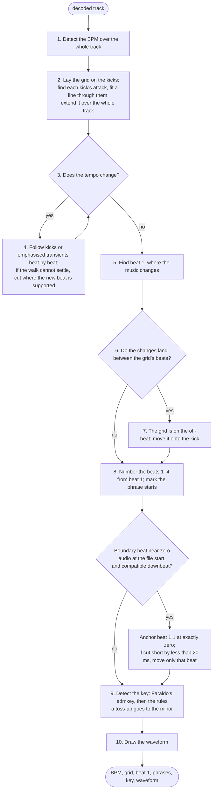

# rbl-analysis

Reads a decoded track and works out its tempo, beat grid, first downbeat,
phrase starts, key and waveform.

Input: mono `f32` samples at the file's sample rate (from `rbl-audio`).
Output: an `Analysis` — the tempo and every beat with its number in the bar,
the key, a three-band waveform, and the track's peak and RMS. Everything is
deterministic: the same samples always give the same result.

The track is assumed to be in 4/4. What happens, in order:



[docs/pipeline.md](docs/pipeline.md) has the full procedure, step by step.
During tempo transitions without a usable kick or click, full-band
transient rises receive 4× gain with a 20 ms exponential release. The
fallback preserves hit timestamps and rejects release tails as new beats.
It also helps place cuts when no reliable kick run establishes the change.
Each stage is a module with its own document:

| stage | module | doc |
|---|---|---|
| Beat grid — tempo, a beat on each kick's attack, tempo changes, gaps | `onset.rs`, `tempo.rs`, `attack.rs` | [docs/beat.md](docs/beat.md) |
| First downbeat — which beat is 1, and whether the grid is on the kick | `downbeat.rs` | [docs/downbeat.md](docs/downbeat.md) |
| File-start adjustment — restore beat 1.1 at zero when the boundary gate passes | `lib.rs::anchor_file_start` | [docs/pipeline.md](docs/pipeline.md#file-start-adjustment) |
| Phrase starts — where sections begin; phrase *labels* are not implemented | `downbeat.rs`, `phrase.rs` | [docs/phrase.md](docs/phrase.md) |
| Key — Faraldo's edmkey front end, the profile match, and the rule pipeline | `key.rs` | [docs/key.md](docs/key.md) |
| Waveform — the three-band strip rekordbox draws | `waveform.rs` | below |

Across the crate:

- [docs/rbxport-beat-analysis.md](docs/rbxport-beat-analysis.md) — the
  complete beat-analysis guide, including transition fallback and timing.
- [docs/rules.md](docs/rules.md) — the rules for how this library's music
  is read, and what the code does with each.
- [docs/golden-gate.md](docs/golden-gate.md) — the reference playlist
  every change is judged against: how to run the comparison, the metrics,
  the recorded numbers, and which tracks missed and why.
- [docs/grid-fixtures.md](docs/grid-fixtures.md) — synthetic WAVs with abrupt,
  linear and curved tempo changes, sample-exact expected grids and a checker.
- [docs/multibpm.md](docs/multibpm.md) — the multi-tempo test: DJ edits
  with tempo changes, analysed here and registered in rekordbox's own
  library, scored against their hand grids.

## Accuracy

Recorded before the transient fallback, against the reference playlist
`RBX-BPM-GRID-TEST` (155 tracks, all
analysed by rekordbox and checked or gridded by hand):

| metric | passes |
|---|---|
| BPM within 0.05 | 155 / 155 |
| first downbeat within 25 ms | 143 / 155 |
| whole grid (98 % of beats within 25 ms, same number) | 142 / 155 |
| key, same name | 141 / 155 |

The target is 99 % on each. Eleven of the playlist's grids come from
rekordbox 6 and sit 25 ms after the kick, and they account for all but one
of the downbeat and grid misses; on the 142 tracks rekordbox 7 analysed
itself the grid agrees on 141. Beats land on the kick's attack, 0.0 ms
from rekordbox 7's at the median and the 90th percentile. Analysis takes
about 460 ms per track. [docs/golden-gate.md](docs/golden-gate.md)
accounts for every miss.

These playlist scores have not been remeasured for the transient fallback.
Its synthetic regressions cover quiet ramps and cuts, release timing,
silence, and preservation of kick timing; see
[docs/grid-fixtures.md](docs/grid-fixtures.md#transitions-without-kicks).

## Waveform

`waveform.rs` makes 150 columns per second. Each column holds the peak of a
low band (below 200 Hz), a mid band, a high band (above 2 kHz), and the
overall peak. The three-band overview (`PWV6`) is measured separately in
1,200 buckets: compressed bass RMS, rectified mid/high energy, and per-band
normalization to the track’s short-window RMS level. Reducing detail peaks
produced an undersized overview with exaggerated spikes. This independent
envelope is calibrated against nine rekordbox references; it remains an
approximation, not byte-identical analysis. Production ANLZ packing lives in
`rbl-anlz::encode`. Existing tracks need their waveforms regenerated. See
[waveform calibration](../../docs/waveform-analysis.md) for measurements and limitations.

## Running it

In the app, **Analyze Track** first opens an Analysis Setting dialog for
BPM/grid, high-precision timing, preset, BPM range and key. Unchecked results
are preserved, and key-only requests leave grid files untouched. See
[track analysis settings](../../docs/analysis-settings.md) for batch and lock behavior.

```
cargo test -p rbl-analysis                                     # synthetic signals with known answers
cargo run --release -p rbl-analysis --example golden -- cache  # decode the reference playlist once (3.6 GB)
cargo run --release -p rbl-analysis --example golden -- eval   # score it, ~5 s
```
