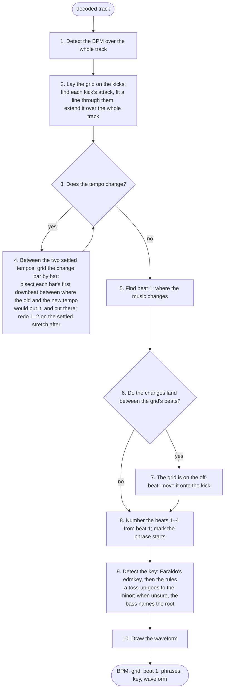

# rbl-analysis

Reads a decoded track and works out its tempo, beat grid, first downbeat,
phrase starts, key and waveform. The results are compared against
rekordbox's own analysis of a 155-track test playlist, and every change is
judged by that comparison.

Input: mono `f32` samples at the file's sample rate (from `rbl-audio`).
Output: an `Analysis` — the tempo and every beat with its number in the bar,
the key, a three-band waveform, and the track's peak and RMS.

What happens, in order (the track is assumed to be in 4/4):



[docs/pipeline.md](docs/pipeline.md) has the full procedure, nineteen steps
with each marked as built, changing or new. Each stage is a module and has
its own document:

| stage | module | doc |
|---|---|---|
| Beat grid — tempo, the position of every beat, tempo changes | `onset.rs`, `tempo.rs` | [docs/beat.md](docs/beat.md) |
| First downbeat — which beat is 1, and whether the grid is on the kick | `downbeat.rs` | [docs/downbeat.md](docs/downbeat.md) |
| Phrase starts — where sections begin; phrase *labels* are not done | `downbeat.rs`, `phrase.rs` | [docs/phrase.md](docs/phrase.md) |
| Key — the chromagram, the profile match, and the rule pipeline | `key.rs` | [docs/key.md](docs/key.md) |
| Waveform — the three-band strip rekordbox draws | `waveform.rs` | (below) |

Two more documents cover the whole crate:

- [docs/rules.md](docs/rules.md) — the rules Chris has set for how this
  library's music is to be read, and what the code does with each.
- [docs/golden-gate.md](docs/golden-gate.md) — the test playlist, how to run
  the comparison, the current numbers, and exactly which tracks miss and why.

## Current numbers

Against the `RBX-BPM-GRID-TEST` playlist (155 tracks):

| metric | before this work | now |
|---|---|---|
| BPM within 0.05 | 146 | **155 / 155** |
| first downbeat within 25 ms | 27 | **151 / 155** |
| whole grid (98 % of beats within 25 ms, same number) | 26 | **146 / 155** |
| key, same name | 27 | **130 / 155** |

The target is 99 % on each. [docs/golden-gate.md](docs/golden-gate.md) lists
every miss.

## Waveform

`waveform.rs` makes 150 columns per second. Each column holds the peak of a
low band (below 200 Hz), a mid band, a high band (above 2 kHz), and the
overall peak. That is the split the ANLZ colour waveforms use, so the
columns map onto `PWV4`/`PWV5` directly.

## Running it

```
cargo test -p rbl-analysis                                   # synthetic signals with known answers
cargo run --release -p rbl-analysis --example golden -- cache  # decode the playlist once (3.6 GB)
cargo run --release -p rbl-analysis --example golden -- eval   # score it, ~5 s
```

Everything is deterministic: the same samples always give the same result.
