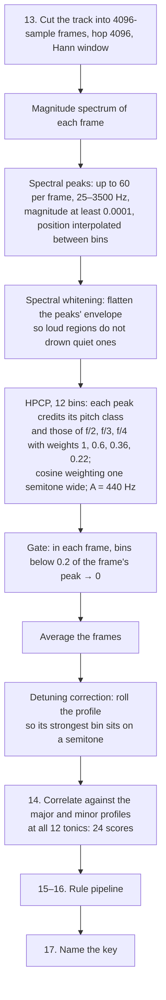

# Key detection

[Analysis documentation](../README.md) · [Code map](../development.md)

`key.rs` converts audio into pitch-class evidence, scores major/minor
profiles, applies ordered rules, and returns an optional named key.
The shipped `PreferMinor` rule does not require a grid; optional bass rules do.

Read [Assumptions](../assumptions.md) for the musical policy and
[Pipeline](../pipeline.md) for grid-dependent ordering. The parameters and
historical measurements below describe this implementation, not a current
accuracy guarantee.



## 13. From audio to a pitch-class profile

- **Frames.** 4096 samples with a hop of 4096 (no overlap) and a Hann
  window. At 44.1 kHz that is 93 ms per frame and 10.8 Hz per bin; the
  peaks below are placed between bins by parabolic interpolation, so the
  pitch is finer than the bin.
- **Spectral peaks.** Local maxima of the magnitude spectrum between
  25 Hz and 3500 Hz, the 60 strongest per frame, anything under a
  magnitude of 0.0001 ignored. Only peaks count: the noise floor between
  notes never enters the profile.
- **Whitening.** The peaks' magnitudes are flattened against the
  spectrum's envelope, so a loud bass region and a quiet upper region
  count alike. Essentia passes peaks within 100 Hz of the top through
  unchanged, which on a spectrum not scaled to 1 lets them outweigh
  everything else; here every peak is whitened alike.
- **HPCP** (harmonic pitch class profile), 12 bins. Each peak at frequency
  f adds its magnitude to the pitch class of f, and also to the classes of
  f/2, f/3 and f/4 with weights 0.6, 0.36 and 0.22 — a note's harmonics,
  which fall on other pitch classes, vote for the note. A peak's weight
  is spread with a cosine window one semitone wide around its pitch.
  Reference pitch A = 440 Hz, which puts A in bin 0; the key profiles
  below are rotated to match.
- **Gate.** In each frame, bins under 0.2 of that frame's strongest bin are
  set to zero, so only the notes actually sounding in the frame count.
- **Average and detuning.** The frames are averaged. If the track sits off
  concert pitch, the profile's strongest bin is off-centre; the profile is
  rolled so it sits on a semitone.

## 14. Profile match

The profile is correlated (Pearson) against a major and a minor key
profile rotated to each of the 12 tonics. The profiles that ship are
Faraldo's `edma`, fitted on electronic dance music:

```
edma major:  1.00 0.29 0.50 0.40 0.60 0.56 0.32 0.80 0.31 0.45 0.42 0.39
edma minor:  1.00 0.31 0.44 0.58 0.33 0.49 0.29 0.78 0.43 0.29 0.53 0.32
```

Four other sets are available for the gate to compare: `bgate`,
Essentia's default for this method — Faraldo's profiles fitted on
Beatport's catalogue and "gated", scale degrees outside the key set to
zero:

```
bgate major: 1.00 0.00 0.42 0.00 0.53 0.37 0.00 0.77 0.00 0.38 0.21 0.30
bgate minor: 1.00 0.00 0.36 0.39 0.00 0.38 0.00 0.74 0.27 0.00 0.42 0.23
```

`braw` (the same, ungated), `edmm` (a flat major profile and an
`edma`-like minor, i.e. "assume minor"), Krumhansl & Kessler's probe-tone
ratings, and Shaath's profiles tuned on popular music.

## 15–16. Rules

The 24 scores go through the rule pipeline. Each rule is a named step
with its own knobs; the gate reports for each how often it fired, what
it fixed and what it broke.

- `PreferMinor { bias }` — a toss-up between a major key and its parallel
  minor goes to the minor: `bias` is added to every minor key's score.
- `BassRoot { margin, source }` — when the best key beats every other
  tonic by less than `margin`, the bass's strongest pitch class becomes
  the tonic and the mode is whichever scores higher there.
- `BassVote { weight, source }` — the bass's chroma at each tonic is added
  to that tonic's scores, weighted.

`source` is where the bass is read, in the 80–400 Hz band: the first and
last 45 s; the first frame of each bar; both; the frames between beats;
the **second eighth** of every beat (the kick, tail included, takes the
first sixteenth to eighth of a beat, so the second eighth is the bass line
alone); the second eighths of the first two bars after each phrase start;
or everything.

`DEFAULT_RULES` is `PreferMinor` at a bias of 0.1. The bass rules stay in
the pipeline for the rig and for other libraries; on the reference
playlist they fix nothing.

## 17. Name

Rekordbox's names: `Dbm`, `F#m`, `Abm`, `Bbm` for the minors, `Db`, `F#`,
`Ab`, `Bb`, `Eb` for the majors, matching `djmdKey.ScaleName`.

## Recorded evaluation

**141 of 155** (91 %) on the reference playlist. `golden key` measures
every combination:

| front end | profiles | rule | exact |
|---|---|---|---|
| edmkey | `edma` | `PreferMinor` 0.1 | 141 |
| edmkey | Shaath | `PreferMinor` 0.2 | 141 |
| edmkey | Krumhansl | `PreferMinor` 0.2 | 140 |
| edmkey | `bgate` | `PreferMinor` 0.1 | 139 |
| edmkey, no whitening | `edmm` | `PreferMinor` 0.5 | 116 |
| whole-spectrum chroma (8192-sample frames, 55 Hz – 2 kHz, no whitening, no gate) | `edmm` | `PreferMinor` 0.5 | 133 |

With `edma`, the profile match alone is right on 103; `PreferMinor` at
0.1 fires on 51 tracks, fixes 44 and breaks 6.

The 14 misses:

- **The same tonic, the other mode** (8): `Acid Jump`, `Airplane Mode`,
  `Alive`, `Around`, `Final Call`, `GIN AND TONIC` and both copies of
  `Guilty Pleasures` — all called major by rekordbox and minor here.
- **A fifth away** (4): `Big Jet Plane` (Bbm → Fm), `Da Ga Dam`
  (Fm → Cm), `Goddess` (Ebm → Abm), `Ride The Train` (F#m → Dbm).
- **Elsewhere** (2): `Tiamat` (Em → F), `XTC Nation` (D → Gm).

## Changing this stage

Follow the [change workflow](../development.md#make-a-change) and run the
[relevant public checks](../validation/README.md#public-tests). Preserve the
input/output contract above and update the reference when options or evidence
change. Report new measurements separately from the recorded results.
