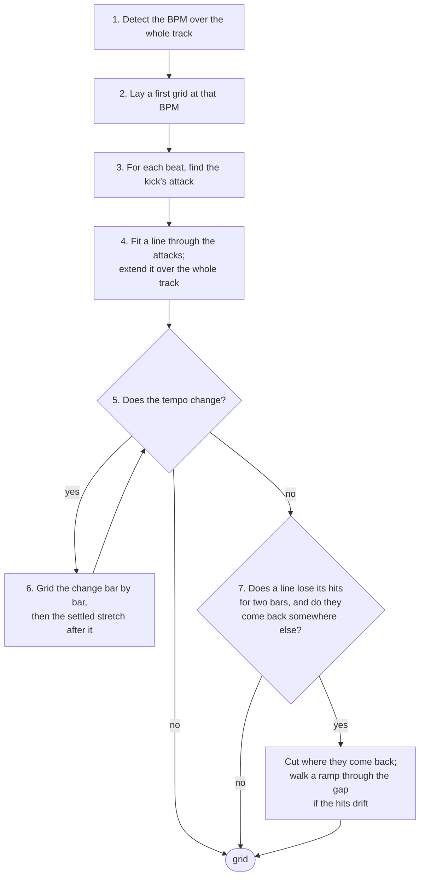

# Beat grid

Finds the tempo and puts a beat on every kick. Code: `onset.rs` (the
onset envelope), `tempo.rs` (tempo, fit, tempo changes) and `attack.rs`
(the kick's attack). Steps 1–6 of [pipeline.md](pipeline.md).

## 1. Detect the BPM

The track is reduced to an **onset envelope**: one number every 256
samples (5.8 ms at 44.1 kHz) saying how much a percussive hit happened
then. It is spectral flux — a 1024-sample window every 256 samples, and
for each window the sum of how much every frequency bin *rose* since the
last one. Rises only, so held notes and decays add nothing and a kick,
which raises many bins at once, adds a lot. A local average is subtracted,
the result is clipped at zero, and the whole envelope is scaled to a peak
of 1. Each value is stamped with the time at the centre of its window.

Two measurements of the envelope are combined, over the whole track:

- **Autocorrelation** — at which lags the envelope lines up with itself.
  Peaks at the beat period and its multiples, and also at one and a half
  beats (kick, hat, kick, hat).
- **Fourier magnitude** — how strong the rhythm is at one exact rate, in
  20-second windows averaged. Strong at the beat rate and its multiples,
  never at two thirds of it. This is what rules out the one-and-a-half
  error.

Every autocorrelation peak between 70 and 200 BPM is a candidate, with its
simple multiples and fractions. Each is scored
`autocorrelation × √fourier × prior`, the prior a broad bell centred on
132 BPM that only breaks ties between octaves. Drum & bass comes back at
174, not 87: the faster octave wins when it carries the rhythm.

The whole track is used, not an excerpt, so a tempo change anywhere is
seen (step 6).

## 2. First grid

The winning BPM is refined to a fraction of an envelope sample with a comb
(the envelope summed at every beat of a trial period, at the best of 32
phases), and the phase is the one of 64 that collects the most onset
energy. This grid is only as accurate as the envelope, ±3 ms; it says
where to look for each kick.

## 3. The kick's attack

Beat 1 is always on the kick, and the grid goes on the kick's *attack*.
The attack is the start of an RMS spike in the 900–9000 Hz band — the
click at the front of a kick, which the kick's body (below 200 Hz) and the
bass line do not have.

For each beat of the first grid:

- band-pass the audio to 900–9000 Hz (done once for the whole track);
- take the RMS in 1 ms steps, 15 ms either side of the beat;
- the spike is the strong rise nearest the beat — at least half as steep
  as the steepest in the window; the attack is the step where it starts.

Nearest, not steepest: taking the steepest let a grid drift, because once
a beat's prediction slipped late the window reached a sharper hit further
on and the line followed it. A beat with no spike near it (a breakdown, a
beatless intro) is left unplaced and does not pull the line in step 4.

The line is fitted twice, from the comb's phase and from half a beat
later, and the one that collects more kick is kept. The phrase-structure
stage ([downbeat.md](downbeat.md)) still has the last word on which half
of the beat the kicks are on: it is right on 153 of 155 rekordbox grids
against the kick's 150, the kick's misses being off-beat claps with a
sharper transient than the kick.

## 4. Fit and extend

A straight line is fitted through the placed beats (time against beat
index), weighted by each spike's height, twice: the second time without
the fifth of beats furthest from the first line and never with any beat
over a tenth of a period off it. Six hundred sample-accurate points fix
the period to well under 0.01 BPM. The line is extended back to the start
of the file — the first beat is the first grid position at or after time
zero, as rekordbox does — and forward to the end.

## 5. Does the tempo change?

The tempo is measured again in 16-second windows over the whole track, by
autocorrelation of each window alone, folded onto the track's octave. A
window where the track's tempo still fits at 60 % of the best peak has not
changed. A second tempo is believed when at least three windows agree on
it, it differs by more than 2 %, and it is not a ratio a rhythm makes on
its own (3⁄2, 2⁄3, 4⁄3, 3⁄4). The stretches where each tempo is *settled*
— consecutive windows at one tempo — are the anchors for step 6.

## 6. Grid the change

Between two settled tempos there is a stretch where the tempo is moving,
or where the old track's beat has stopped and the new one is coming in.
Both are gridded from the last settled bar at the old tempo forward,
one bar at a time:

- the next bar's first downbeat lies between where the old tempo would
  put it and where the new tempo would put it;
- bisect between those two bounds, looking for the kick's attack (step 3)
  nearest each trial point, until the downbeat is found;
- put a cut there: the bar just gridded gets its own tempo, its own
  length divided into four;
- repeat until a bar comes out at the new settled tempo, then run steps
  1–4 on the settled stretch after it.

A rise or fall that is gradual and not linear is followed a bar at a time.
The beat count carries on 1–4 across every cut, as rekordbox writes it,
and each beat carries the tempo of its bar, which rekordbox's grid format
allows.

A DJ edit, where the walk finds no ramp, is a cut. The next track comes in
under the last one's breakdown bars before it drops — an impact on a
downbeat, an arp in eighths, claps on two and four, a snare roll into the
drop, its own kick at half level — and the hand grids hold the old tempo
until the kick states the new one at full level. So the kick is read on
every beat of the new grid, from the old tempo's last settled window to
the end of the new tempo's settled stretch: the kick band (spectral flux
under 200 Hz, from the audio low-passed and decimated by 32, scaled so
its strong hits read as one) where the stretch has one, the click attack
where it does not. Its runs — stretches of bars that read it — are found
at its gaps, and a run weaker than 0.55 of the strongest, or shorter than
two bars, is not the beat yet: the incoming kick pattern under a
breakdown sits at 0.49 of its eventual level, a kick returning after a
breakdown at 0.58 of the level it reaches a minute later. The cut goes in
the first bar of the first run that is the beat: not a fill into the bar
after it (twice as much kick), starting on the beat, carrying the rest of
the mix (full-band flux at 0.7 of its settled level), and read better by
the new grid than by the old one carried on. Within that bar the cut is
the first beat whose kick is half the bar's strongest, with the mix on it
and, where the section's kicks have a click, with the click: the beat
before a drop is a pickup, a kick roll into a drop is thumps without
clicks. Where no run qualifies — the new tempo's stretch is a breakdown
with no kick of its own — the cut goes where the onsets stop following
the old grid and start following the new, the earliest such beat.

Measured on the multi-tempo playlist ([multibpm.md](multibpm.md)): seven
of the ten hand-gridded changes are placed within 3 ms; the three that
are not are where the hand grid switches at the impact that ends a
section, with the new tempo's kick arriving twenty seconds later.

## 7. A whole number

A steady tempo within 0.1 BPM of a whole number is that whole number: the
line is fixed at that period and re-phased through the same kicks, so it
turns about their centre. Every golden track is at a whole tempo and the
fit lands within 0.04 of it on all of them. The bars of a walked change
keep their measured tempo.

## 7. Gaps

A line fitted through a stretch is only right where its hits are on it.
After the segments are fitted, each line is checked beat by beat for a
hit (a peak of the onset envelope within a tenth of a beat). Two bars or
more without one is a gap, and what comes after the gap decides what
happens to it:

- **The line resumes on its own grid** (two bars of hits on it again): it
  holds across the gap, whatever the breakdown did, as the hand grids
  hold. Nothing changes.
- **The music comes back at the same tempo on another phase.** The
  stretches before and after the gap are fitted on their own, and each is
  put on its kicks by the kick band's own onset envelope (the attack
  judge inside the fit is wrong on one stretch in thirty, and two halves
  it put on different halves of the beat would read as a phase change).
  When both halves say where their kicks are, their lines differ by more
  than a tenth of a beat, and the new line collects half again as much
  kick after the gap as the old one carried on, the grid cuts: at the
  first bar of hits on the new line, the old line dropping its beat
  within half a beat of the cut. A stretch after the gap shorter than 64
  beats — an outro's last bars — is never believed to have a phase of its
  own.
- **The hits through the gap drift** — an eighth-note bass under a
  tape-stop, slowing bar after bar with no kick to follow. From the last
  supported beat before the gap the hits are walked on the full-band
  envelope: each next beat is looked for from three quarters of the last
  period to five quarters of where the last two periods put it (the
  eighth note between two beats stays outside that window), the strongest
  peak for its distance from the prediction wins, a hit must be a quarter
  of the mean of the last four, and the period may change by up to 30 %
  a beat. Eight beats going one way, with the period at least 5 % from
  the line's, are a ramp, and each walked beat becomes a segment of its
  own length, up to the cut; the stretch from the last walked beat to the
  cut is whole beats at the pace the ramp was going. A ramp is only
  gridded where it leads somewhere: through a gap whose line comes back
  on its own grid it is a breakdown, and the line holds.

`BATTERY OPERATED` is the case this was built on: 130 BPM to bar 65, then
the kick stops and the bass slows from an eighth of 231 ms to one of 1.4 s
by 2:22, silence, and 130 again from 2:27.0 on a phase 208 ms from the
old line's. The hand grid holds 130 through the slowdown and re-phases
at 2:27.0; ours holds to bar 65, follows the bass beat by beat down to
22 BPM, and cuts at the same millisecond.

## Output

`TempoResult`:

- `bpm` — the tempo the track starts at, which is what a library shows.
- `segments` — one per tempo: where it starts and ends, the period, and
  any beat's time. A bar-by-bar transition is a run of one-bar segments;
  a walked ramp a run of one-beat segments.
- `beats` — every beat's time in ms, its tempo ×100, and its number in the
  bar. Numbering is 1–4 from the first beat here; [downbeat.md](downbeat.md)
  fixes it on the first tempo's music, and the count carries on across
  every change as rekordbox numbers a hand grid. An old-tempo beat within
  half a period before a change is the same hit as the new tempo's first
  beat and is dropped.
- `confidence` — how far the winning tempo stood above the best candidate
  that is not a simple ratio of it.
