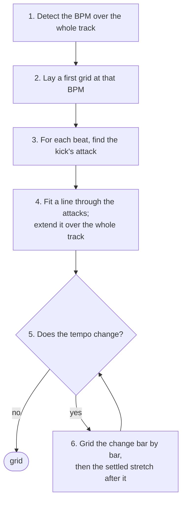

# Beat grid

Finds the tempo and puts a beat on every kick. Code: `onset.rs` (the
onset envelope), `tempo.rs` (tempo, fit, tempo changes) and `attack.rs`
(the kick's attack). Steps 1–6 of [pipeline.md](pipeline.md).

## 1. Detect the BPM

The track is reduced to an **onset envelope**: one number every 256
samples (5.8 ms at 44.1 kHz) saying how much a percussive hit happened
then. It is spectral flux — a 1024-sample window every 256 samples, and
for each window the sum of how much every frequency bin *rose* since the
last one. Rises only, so held notes and decays add nothing and a kick,
which raises many bins at once, adds a lot. A local average is subtracted,
the result is clipped at zero, and the whole envelope is scaled to a peak
of 1. Each value is stamped with the time at the centre of its window.

Two measurements of the envelope are combined, over the whole track:

- **Autocorrelation** — at which lags the envelope lines up with itself.
  Peaks at the beat period and its multiples, and also at one and a half
  beats (kick, hat, kick, hat).
- **Fourier magnitude** — how strong the rhythm is at one exact rate, in
  20-second windows averaged. Strong at the beat rate and its multiples,
  never at two thirds of it. This is what rules out the one-and-a-half
  error.

Every autocorrelation peak between 70 and 200 BPM is a candidate, with its
simple multiples and fractions. Each is scored
`autocorrelation × √fourier × prior`, the prior a broad bell centred on
132 BPM that only breaks ties between octaves. Drum & bass comes back at
174, not 87: the faster octave wins when it carries the rhythm.

The whole track is used, not an excerpt, so a tempo change anywhere is
seen (step 6).

## 2. First grid

The winning BPM is refined to a fraction of an envelope sample with a comb
(the envelope summed at every beat of a trial period, at the best of 32
phases), and the phase is the one of 64 that collects the most onset
energy. This grid is only as accurate as the envelope, ±3 ms; it says
where to look for each kick.

## 3. The kick's attack

Beat 1 is always on the kick, and the grid goes on the kick's *attack*.
The attack is the start of an RMS spike in the 900–9000 Hz band — the
click at the front of a kick, which the kick's body (below 200 Hz) and the
bass line do not have.

For each beat of the first grid:

- band-pass the audio to 900–9000 Hz (done once for the whole track);
- take the RMS in 1 ms steps, 15 ms either side of the beat;
- the spike is the strong rise nearest the beat — at least half as steep
  as the steepest in the window; the attack is the step where it starts.

Nearest, not steepest: taking the steepest let a grid drift, because once
a beat's prediction slipped late the window reached a sharper hit further
on and the line followed it. A beat with no spike near it (a breakdown, a
beatless intro) is left unplaced and does not pull the line in step 4.

The line is fitted twice, from the comb's phase and from half a beat
later, and the one that collects more kick is kept. The phrase-structure
stage ([downbeat.md](downbeat.md)) still has the last word on which half
of the beat the kicks are on: it is right on 153 of 155 rekordbox grids
against the kick's 150, the kick's misses being off-beat claps with a
sharper transient than the kick.

## 4. Fit and extend

A straight line is fitted through the placed beats (time against beat
index), weighted by each spike's height, twice: the second time without
the fifth of beats furthest from the first line and never with any beat
over a tenth of a period off it. Six hundred sample-accurate points fix
the period to well under 0.01 BPM. The line is extended back to the start
of the file — the first beat is the first grid position at or after time
zero, as rekordbox does — and forward to the end.

## 5. Does the tempo change?

The tempo is measured again in 16-second windows over the whole track, by
autocorrelation of each window alone, folded onto the track's octave. A
window where the track's tempo still fits at 60 % of the best peak has not
changed. A second tempo is believed when at least three windows agree on
it, it differs by more than 2 %, and it is not a ratio a rhythm makes on
its own (3⁄2, 2⁄3, 4⁄3, 3⁄4). The stretches where each tempo is *settled*
— consecutive windows at one tempo — are the anchors for step 6.

## 6. Grid the change

Between two settled tempos there is a stretch where the tempo is moving,
or where the old track's beat has stopped and the new one is coming in.
Both are gridded from the last settled bar at the old tempo forward,
one bar at a time:

- the next bar's first downbeat lies between where the old tempo would
  put it and where the new tempo would put it;
- bisect between those two bounds, looking for the kick's attack (step 3)
  nearest each trial point, until the downbeat is found;
- put a cut there: the bar just gridded gets its own tempo, its own
  length divided into four;
- repeat until a bar comes out at the new settled tempo, then run steps
  1–4 on the settled stretch after it.

A rise or fall that is gradual and not linear is followed a bar at a time;
a DJ edit where the new beat arrives under a breakdown gets its cut at the
first bar where the kick is found at the new tempo. The beat count carries
on 1–4 across every cut, as rekordbox writes it, and each beat carries the
tempo of its bar, which rekordbox's grid format allows.

## Output

`TempoResult`:

- `bpm` — the tempo the track starts at, which is what a library shows.
- `segments` — one per tempo: where it starts and ends, the period, and
  any beat's time. A bar-by-bar transition is a run of one-bar segments.
- `beats` — every beat's time in ms, its tempo ×100, and its number in the
  bar. Numbering is 1–4 from the first beat here; [downbeat.md](downbeat.md)
  fixes it.
- `confidence` — how far the winning tempo stood above the best candidate
  that is not a simple ratio of it.
