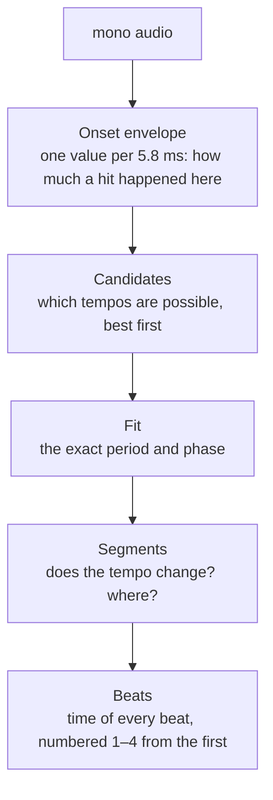

# Beat grid

Finds the tempo and the time of every beat. Code: `onset.rs` (the onset
envelope) and `tempo.rs` (everything after it).



## 1. Onset envelope

The rest of the stage never looks at the audio. It looks at a list of
numbers, one every 256 samples (5.8 ms at 44.1 kHz), saying how much a
percussive hit happened at that moment.

How it is made:

- Take a 1024-sample window every 256 samples and compute its spectrum.
- For each window, sum how much every frequency bin *rose* since the
  previous window. Only rises count. A held note or a fading sound adds
  nothing; a kick, which raises many bins at once, adds a lot.
- Subtract a local average (±16 values) and clip at zero, so a quiet intro
  and a loud drop count the same.
- Scale the whole thing so its peak is 1.

Each value is stamped with the time at the *centre* of its window. A hit
raises the spectrum most as the window's middle passes over it, so that is
when the value peaks. Stamping the start of the window put every beat 12 ms
early.

## 2. Candidates

Two measurements are combined. Each has a failure the other does not.

**Autocorrelation.** Slide the envelope against itself and see at which
lags it lines up. It lines up at the beat period and at every multiple of
it. It also lines up at one and a half beats: a grid that wide lands on
kick, hat, kick, hat, and hats show up strongly in the envelope. Tracks were
coming back at two thirds of their real tempo because of this.

**Fourier magnitude.** How strong the envelope's rhythm is at one exact rate.
It is strong at the beat rate and at multiples of it (twice the tempo,
three times). It is *not* strong at two thirds of the tempo, because a
rhythm has no component slower than its own pulse. It is measured in
20-second windows and averaged, not over the whole track: over five minutes
a candidate a tenth of a BPM off drifts through most of a cycle and cancels
itself out.

Every peak of the autocorrelation between 70 and 200 BPM is a candidate,
and so are its simple multiples and fractions (×2, ×½, ×3⁄2, ×2⁄3, ×3, ×⅓,
×4⁄3, ×¾) when they fall in range. Each candidate is scored:

```
score = autocorrelation × √fourier × prior
```

The prior is a broad bell centred on 132 BPM; it only breaks ties between
octaves. The Fourier term is square-rooted because its job is to throw out a
candidate with no rhythm at its rate at all, not to prefer the hi-hat rate
over the beat.

Which octave is "the" tempo is a convention. Drum & bass with kick and snare
alternating at 87 comes back as 174, which is what rekordbox does and what
the test playlist wants. Nothing in the playlist is below 123 BPM, so the
slow end is untested.

## 3. Fit

The winning candidate is only accurate to about one envelope sample. A grid
needs far better: at 130 BPM, 0.05 BPM of error is 115 ms of drift over five
minutes, a beat and a half by the end.

- **Period.** Try fractional periods around the candidate. Score each by a
  comb: add up the envelope at every beat of that period, at the best of 32
  starting phases. A sweep of ±1 sample in 0.02 steps, then ±0.03 in 0.002
  steps around the winner.
- **Phase.** With the period fixed, try 64 starting phases across one beat
  and keep the best, sharpened by fitting a parabola through its
  neighbours.
- **Snap and refit.** Move each predicted beat to the highest envelope
  value within ±20 % of a beat (again sharpened by a parabola). Fit a
  straight line through the snapped beats, weighted by how strong each hit
  was. Beats with next to no hit (under a fifth of the median) are left
  out: an intro of pads has a small noise bump near every predicted beat,
  and a minute of those bends the line. Then refit without the fifth of
  beats furthest from the first line, and never with any beat over a tenth
  of a period off it: a stretch of swung percussion pulls the tempo by a
  hundredth of a BPM otherwise. Three passes.

Six hundred beats average a 5.8 ms hop down to well under a millisecond. On
the test playlist our beats sit 0 to +3 ms from rekordbox's (median +1 ms).

## 4. Segments

A DJ edit can jump tempo part-way through. Rekordbox writes such a track as
one tempo, then another, with the beat count carrying on 1–4 across the
join. One straight line through such a track is wrong on both sides.

- Measure the tempo in 16-second windows, hopping 8 seconds, by
  autocorrelation of the window alone, with the result folded onto the
  octave of the track's tempo.
- A window where the track's own tempo still fits at 60 % of the best
  peak has not changed (a breakdown that keeps only the hats is not a tempo
  change).
- A different tempo is believed when at least three windows agree on it,
  it differs from the track's by more than 2 %, and it is not a ratio a
  rhythm makes on its own (3⁄2, 2⁄3, 4⁄3, 3⁄4: a dotted-eighth delay or a
  triplet feel).
- Every window is assigned to the nearest known tempo; a lone window
  between two of the other tempo is absorbed; an intro with no beat belongs
  to the first tempo heard.
- Each run of windows is fitted on its own (step 3).

**Where the change goes.** Not where the new beat first appears. In a DJ
edit the next track's beat comes in under the last one's breakdown at a
third to a half of its final level, for several bars, and rekordbox holds
the old grid until the drop. So the change is placed at the first beat of
the new grid that starts four beats in a row each at least 75 % as strong
as the new stretch's median beat, and whose next two bars are at least as
well supported as the old grid's would be. (Two grids at nearby tempos
drift through each other, and for a few beats every cycle the new one
lands on the old one's hits and looks supported.) On `Go Back [136-174]`
this lands on rekordbox's change to the millisecond.

The first beat of the first segment is the first grid position at or after
time zero — the grid is extended back to the start of the file, which is
what rekordbox does too. A track whose first kick is at the very start
gets a first beat at ~24 ms, the MP3 encoder delay.

## Output

`TempoResult`:

- `bpm` — the tempo the track starts at, which is what a library shows.
- `segments` — one per tempo: where it starts and ends, the period, and
  any beat's time (the grid is that plus whole periods).
- `beats` — every beat's time in ms, its tempo ×100 (as ANLZ stores it),
  and its number in the bar. Numbering is 1–4 from the first beat here;
  [downbeat.md](downbeat.md) fixes it.
- `confidence` — how far the winner stood above the best candidate that is
  not a simple ratio of it.

`tempo_candidates`, `local_tempos` and `fit_report` expose the inner tables
for the test rig.
