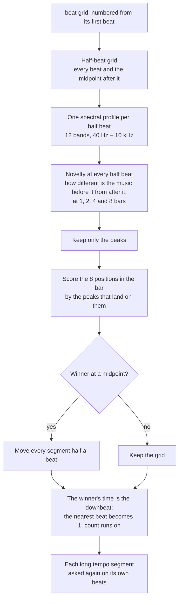

# First downbeat

Decides which beat is beat 1, and checks that the grid is on the kick and
not on the off-beat. Code: `downbeat.rs`, applied in `lib.rs::analyse`.
Steps 8–12 of [pipeline.md](pipeline.md).

## Why structure, not the kick

The loudest hits do not pick the beat on every track. On tech house the
open hat between the kicks shows up in the onset envelope as strongly as
the kick; on hardstyle the reverse bass on the off-beat does. On the
reference playlist the full spectrum picks the off-beat on 22 tracks, a
0–200 Hz band on 19, 0–4 kHz on 8, and a "low-band hit *and* mid-band hit
at the same instant" test on 54. No band tells the kick from the off-beat
on every track.

Structure does. Dance music changes at bar lines and, much more strongly,
at phrase lines eight or sixteen bars apart — a drop, a breakdown, a new
bass line, a filter opening. Every such change lands on beat 1, and beat 1
is a kick, never an off-beat. So the question "which position in the bar
does the music change on?" answers both "which beat is 1?" and "is the
grid on the beat at all?".

## How

1. **Half-beat grid.** Every beat and the midpoint after it: eight
   positions per bar.
2. **Profiles.** For each half beat, the mean log energy in twelve
   log-spaced bands from 40 Hz to 10 kHz (a 2048-sample spectrum every 512
   samples, averaged over the half beat).
3. **Novelty.** At each half beat, and at each of four scales (one, two,
   four and eight bars), the distance between the average profile over
   that many half beats *before* it and over that many *after* it. A big
   number means the music is different on the two sides.
4. **Peaks only.** Only local maxima of the novelty count. A slow
   crescendo raises every half beat alike, so the novelty summed as it
   stands puts nearly equal weight on every position (the best leads the
   next by 3 %); its peaks separate them by 2.8×. Each scale's peaks are
   normalised to sum to 1 so a long phrase counts as much as a bar.
5. **Score the eight positions** by the peaks that land on each. The
   winner is the downbeat position.
6. **Move if needed.** An odd position means the music changes on the
   midpoints — the grid was built on the off-beat. Every tempo segment is
   shifted by half a period.
7. **Number.** The winner's time is the downbeat. Whichever beat is nearest
   it becomes 1 and the count runs on from there through every segment.
8. **First tempo.** When a multi-tempo track's first segment has at least
   32 beats, choose its bar position from its own music. Later tempos must
   not outvote the opening section. The chosen 1–4 count then carries
   through every later segment, including individual ramp intervals.

## Accuracy

On rekordbox's own grids (`golden downbeat`) this picks rekordbox's
downbeat on 153 of the 155 reference tracks. On our grids the downbeat
metric passes on 143: the eleven rekordbox 6 grids miss by the 25 ms
their beats sit off the kick ([golden-gate.md](golden-gate.md)), and on
`Go Back [136-174]` the novelty peaks land a beat before each phrase
change, so beat 1 is one beat early throughout.

## Also produced here

The novelty peaks at the four-bar scale that fall on downbeats are the
**phrase starts** — see [phrase.md](phrase.md).

## Final file-start adjustment

After this stage, `analyse_with` calls `lib.rs::anchor_file_start`. A grid
aligned near zero with audio at the file boundary and compatible downbeat
selection is anchored to beat 1.1
at exactly `0:00.00`. This can override fallback numbering at the first emitted beat; a distinct
later musical downbeat is preserved. The
conditions, ordering and regression tests are documented in
[pipeline.md — File-start adjustment](pipeline.md#file-start-adjustment).

When less than 20 ms of the opening beat was cut off, the adjustment adds
only beat 1.1 at zero and preserves every later beat's timestamp and BPM.
The shortened first interval is represented by a one-beat opening segment;
[pipeline.md](pipeline.md#file-start-adjustment) documents the cutoff check.

For a repeating pattern without meaningful four-bar spectral novelty,
`grid_phase_from` retains its first-beat fallback instead of magnifying FFT
alignment noise into a downbeat decision. The gate is a maximum four-bar
novelty below 0.5 in the Euclidean distance of mean log-band energies.
A first tempo segment of at least 32 beats can choose its own phase,
so the later tempo or ramp does not outvote a shorter opening section.
