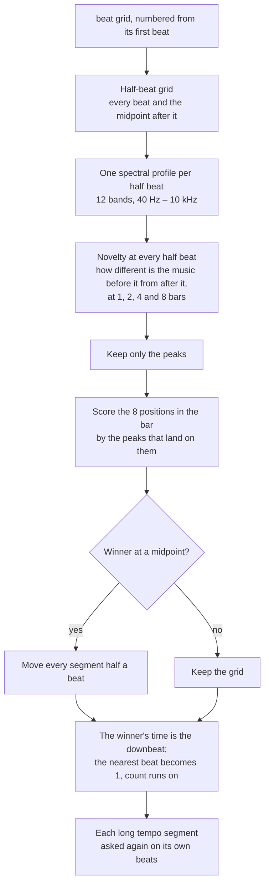

# First downbeat

Decides which beat is beat 1, and checks that the grid is on the kick and
not on the off-beat. Code: `downbeat.rs`, applied in `lib.rs::analyse`.
Steps 7–11 of [pipeline.md](pipeline.md).

## Why not just look at the kick

The obvious way to pick the beat is to find the loudest hits. It does not
work on every track. On tech house the open hat between the kicks shows up
in the onset envelope as strongly as the kick; on hardstyle the reverse
bass on the off-beat does. On the test playlist, the full spectrum picked
the off-beat on 22 tracks, a 0–200 Hz band on 19, 0–4 kHz on 8, and a
"low-band hit *and* mid-band hit at the same instant" test on 54. No band
told the kick from the off-beat on every track.

Structure does. Dance music changes at bar lines and, much more strongly,
at phrase lines eight or sixteen bars apart — a drop, a breakdown, a new
bass line, a filter opening. Every such change lands on beat 1, and beat 1
is a kick, never an off-beat. So the question "which position in the bar
does the music change on?" answers both "which beat is 1?" and "is the
grid on the beat at all?".

## How

1. **Half-beat grid.** Every beat and the midpoint after it: eight
   positions per bar.
2. **Profiles.** For each half beat, the mean log energy in twelve
   log-spaced bands from 40 Hz to 10 kHz (a 2048-sample spectrum every 512
   samples, averaged over the half beat).
3. **Novelty.** At each half beat, and at each of four scales (one, two,
   four and eight bars), the distance between the average profile over
   that many half beats *before* it and over that many *after* it. A big
   number means the music is different on the two sides.
4. **Peaks only.** Summing the novelty itself put nearly equal weight on
   every position — the best beat led the next by 3 % — because a slow
   crescendo raises every half beat alike. Keeping only local maxima
   raises that lead to 2.8×. Each scale's peaks are normalised to sum to 1
   so a long phrase counts as much as a bar.
5. **Score the eight positions** by the peaks that land on each. The
   winner is the downbeat position.
6. **Move if needed.** An odd position means the music changes on the
   midpoints — the grid was built on the off-beat. Every tempo segment is
   shifted by half a period.
7. **Number.** The winner's time is the downbeat. Whichever beat is nearest
   it becomes 1 and the count runs on from there through every segment.
8. **Per segment.** Any tempo segment of at least 64 beats is asked again
   on its own beats and renumbered from its own downbeat. A DJ edit's two
   halves are two pieces of music, and a bar count carried across a tempo
   change that landed a beat off would misnumber the whole second half.
   A bar-by-bar transition ([beat.md](beat.md), step 6) needs no asking:
   its cuts are downbeats by construction, so the count runs 1–4 through
   it from the settled stretch before.

On rekordbox's own grids, this picks rekordbox's downbeat on 153 of the
155 test tracks (`golden downbeat`). On our grids it is 151.

## What it gets wrong

- `BATTERY OPERATED`: rekordbox's beats sit where every band of the
  spectrum and the phrase structure say the off-beat is. Half a beat off.
- `Go Back [136-174]`: our beat 1 is one beat before rekordbox's,
  throughout. The novelty peaks land a beat before each phrase change.
  Chris re-checked this grid by hand; rekordbox's is right.

## Also produced here

The novelty peaks at the four-bar scale that fall on downbeats are the
**phrase starts** — see [phrase.md](phrase.md).
