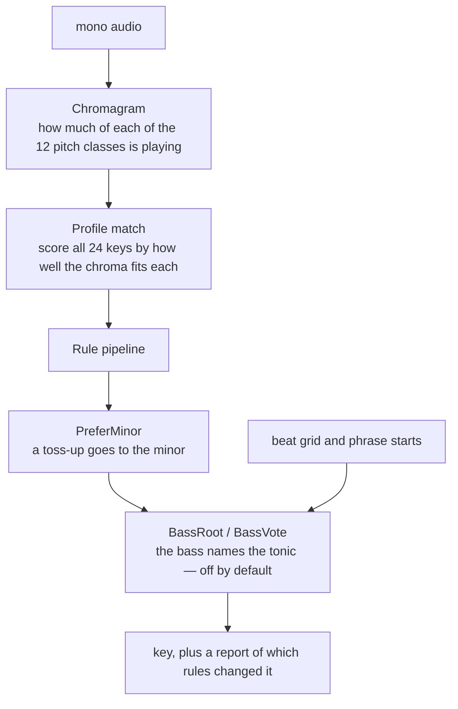

# Key

Finds the musical key and names it the way rekordbox does (`Fm`, `Db`,
`F#m`). Code: `key.rs`.

## 1. Chromagram

A chromagram folds the whole spectrum onto the twelve pitch classes: how
much C is playing, how much C♯, and so on, ignoring octave.

- A 8192-sample spectrum every 4096 samples. 8192 gives 5.4 Hz per bin,
  which is enough to tell semitones apart down to about 90 Hz. (The 1024
  used for beats resolves 43 Hz — useless for pitch.)
- Each bin from 55 Hz to 2 kHz contributes its magnitude, split between
  the two nearest of 36 sub-bins per octave (three per semitone), so
  nothing is lost between the cracks. Above 2 kHz there is little but hats
  and upper partials; 1, 1.5, 3 and 5 kHz cut-offs all scored lower.
- **Harmonics fold down.** A note also puts energy at 2×, 3× and 4× its
  frequency, which land on other pitch classes (the fifth, the major
  third) and pull the answer a fifth away. So each bin also credits the
  sub-bins of f/2, f/3 and f/4, with weights 0.6, 0.36 and 0.22.
- The frames are summed, and each class is its centre sub-bin plus a
  quarter of each neighbour.

The earlier version added `ln(1 + magnitude)` for every bin near a
semitone. That made each class's total mostly *the number of bins that
round to it* — a fixed pattern — and read most of the playlist as C minor
(27 of 155 right).

**Tuning.** The 36 sub-bins let the chroma be centred on a track's actual
tuning. It is off by default: it changed nothing on the playlist, which is
at concert pitch throughout.

## 2. Profile match

A key profile says how much each scale degree belongs to a key. The chroma
is correlated (Pearson) against the profile rotated to each of the 12
tonics, for major and minor: 24 scores. Faraldo's `edma` profiles, fitted
to electronic dance music, beat Krumhansl, Temperley, Shaath and a plain
diatonic profile here.

On its own the profile match gets 89 of 155.

## 3. Rule pipeline

After the match, named rules are applied in order to the 24 scores. Each
has its own knobs, and the test rig reports for each one how often it
fired, what it fixed and what it broke. The rules come from
[rules.md](rules.md).

| rule | what it does | shipped | measured |
|---|---|---|---|
| `PreferMinor { bias }` | adds `bias` to every minor key's score | yes, 0.3 | fires on 65 tracks, fixes 50, breaks 9: **89 → 130** |
| `BassRoot { margin, source }` | when the best key beats every other tonic by less than `margin`, the bass's strongest pitch class becomes the tonic | no | fixes 0, breaks up to 9 at any margin or source |
| `BassVote { weight, source }` | adds `weight` × the bass chroma at each tonic to that tonic's scores | no | 127–128 at best |

`source` says where the bass is read: the first and last N seconds, the
first frame of each bar, both, the frames between beats, the second eighth
of every beat (the kick takes the first sixteenth to eighth; the second
eighth is the bass line alone), the second eighths of the first N bars of
each phrase, or everything. The band is 80–400 Hz with one subharmonic
folded in — measured against 40–120, 55–250, 80–250, 55–500 and 40–250.

How good the bass is as evidence on its own — how often its strongest
pitch class *is* rekordbox's tonic (`golden bassroot`):

| window | tonic right (of 155) |
|---|---|
| everything | 101 |
| first and last 45 s | 87 |
| first frame of each bar | 57 |
| between beats | 102 |
| second eighth of every beat | **105** |
| second eighths, first 2 bars of each phrase | 99 |
| second eighths, first 4 bars of each phrase | 98 |

105 of 155 is below the profile match's 130, and on the close calls where
a fallback would fire it is not right more often than the match, so no
bass rule ships. The rules stay in the pipeline for the rig and for other
libraries.

## Result

**130 of 155** (84 %), 138 within a fifth or the relative key.

Of the 25 misses: 11 are the same tonic in the other mode (mostly tracks
rekordbox calls major; rekordbox itself calls `Dolce (Extended Mix)` D and
`Dolce (Extended Instrumental Mix)` D minor), 8 are a fifth away, 6 are
elsewhere. Rekordbox's key is our runner-up on 14 of them and third on 6.

Also tried, with no gain: deciding the mode from the third above the
tonic; a separate, smaller bias for the mode; per-frame normalisation;
three to six harmonics; profiles learned from the playlist itself with
each track held out (132 at best, within noise of 130).
