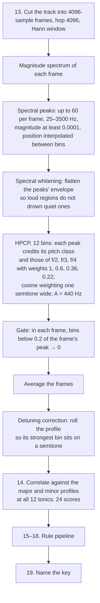

# Key

Finds the musical key and names it the way rekordbox does (`Fm`, `Db`,
`F#m`). Code: `key.rs`. Steps 13–19 of [pipeline.md](pipeline.md).

The front end is Ángel Faraldo's **edmkey** method, as Essentia's
`KeyExtractor` runs it. Every number below is Essentia's default, taken
from its source. After it, the rules in [rules.md](rules.md) are applied.



## 13. From audio to a pitch-class profile

- **Frames.** 4096 samples with a hop of 4096 (no overlap) and a Hann
  window. At 44.1 kHz that is 93 ms per frame and 10.8 Hz per bin; the
  peaks below are placed between bins by parabolic interpolation, so the
  pitch is finer than the bin.
- **Spectral peaks.** Local maxima of the magnitude spectrum between
  25 Hz and 3500 Hz, the 60 strongest per frame, anything under a
  magnitude of 0.0001 ignored. Only peaks count: the noise floor between
  notes never enters the profile.
- **Whitening.** The peaks' magnitudes are flattened against the
  spectrum's envelope, so a loud bass region and a quiet upper region
  count alike.
- **HPCP** (harmonic pitch class profile), 12 bins. Each peak at frequency
  f adds its magnitude to the pitch class of f, and also to the classes of
  f/2, f/3 and f/4 with weights 0.6, 0.36 and 0.22 — a note's harmonics,
  which fall on other pitch classes, vote for the note. A peak's weight
  is spread with a cosine window one semitone wide around its pitch.
  Reference pitch A = 440 Hz.
- **Gate.** In each frame, bins under 0.2 of that frame's strongest bin are
  set to zero, so only the notes actually sounding in the frame count.
- **Average and detuning.** The frames are averaged. If the track sits off
  concert pitch, the profile's strongest bin is off-centre; the profile is
  rolled so it sits on a semitone.

## 14. Profile match

The profile is correlated (Pearson) against a major and a minor key
profile rotated to each of the 12 tonics. Essentia's default for this
method is `bgate` — Faraldo's profiles fitted on Beatport's catalogue and
"gated": scale degrees that do not belong to the key are zero.

```
bgate major: 1.00 0.00 0.42 0.00 0.53 0.37 0.00 0.77 0.00 0.38 0.21 0.30
bgate minor: 1.00 0.00 0.36 0.39 0.00 0.38 0.00 0.74 0.27 0.00 0.42 0.23
```

Three sister profiles are also available: `braw` (the same, ungated),
`edma` (fitted on electronic dance music):

```
edma major:  1.00 0.29 0.50 0.40 0.60 0.56 0.32 0.80 0.31 0.45 0.42 0.39
edma minor:  1.00 0.31 0.44 0.58 0.33 0.49 0.29 0.78 0.43 0.29 0.53 0.32
```

and `edmm` (a flat major profile and an `edma`-like minor, i.e. "assume
minor"). The gate scores all four; the one that ships is the one that
agrees with rekordbox most.

## 15–18. Rules

The 24 scores go through the rule pipeline. Each rule is a named step
with its own knobs; the gate reports for each how often it fired, what
it fixed and what it broke.

- `PreferMinor { bias }` — a toss-up between a major key and its parallel
  minor goes to the minor: `bias` is added to every minor key's score.
- `BassRoot { margin, source }` — when the best key beats every other
  tonic by less than `margin`, the bass's strongest pitch class becomes
  the tonic and the mode is whichever scores higher there.
- `BassVote { weight, source }` — the bass's chroma at each tonic is added
  to that tonic's scores, weighted.

`source` is where the bass is read, in the 80–400 Hz band: the first and
last 45 s; the first frame of each bar; both; the frames between beats;
the **second eighth** of every beat (the kick, tail included, takes the
first sixteenth to eighth of a beat, so the second eighth is the bass line
alone); the second eighths of the first two bars after each phrase start;
or everything.

Which rules ship, with which knobs, is decided by the gate
([golden-gate.md](golden-gate.md)); the rules that do not ship stay in the
pipeline for the rig and for other libraries.

## 19. Name

Rekordbox's names: `Dbm`, `F#m`, `Abm`, `Bbm` for the minors, `Db`, `F#`,
`Ab`, `Bb`, `Eb` for the majors, matching `djmdKey.ScaleName`.

## Before this front end

The earlier front end credited every spectrum bin (not just peaks) from
8192-sample frames between 55 Hz and 2 kHz, with the same harmonic
folding, no whitening and no gate, matched against `edma` with
`PreferMinor` at 0.3. It scored 130 of 155; the profile match alone 89,
the bass rules fixed none. The eleven remaining mode misses, eight fifths
and six others are listed in [golden-gate.md](golden-gate.md). Faraldo's
front end is measured against that 130.
