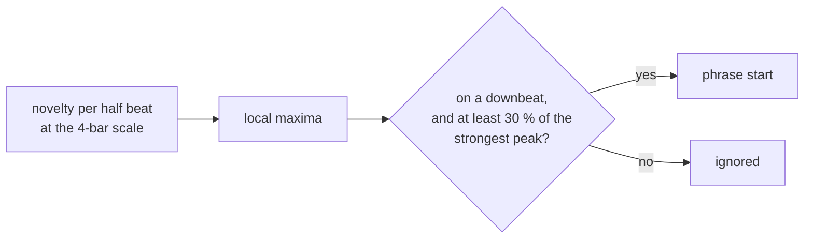

# Phrases

Two different things go by this name. One is done, one is not.

## Phrase starts — done

Where sections begin: the downbeats at which the music changes most over
the four bars either side. They come out of the downbeat stage for free
(see [downbeat.md](downbeat.md)) and are used by the key rules that read
the bass at the start of a phrase.

On the test playlist this finds about six phrase starts per track. They
are times in seconds, in order, in `GridPhase::phrase_starts`, and are
passed to key detection as `KeyGrid::phrase_starts`.

## Phrase labels — not done

Rekordbox's `PSSI` tag labels each section: intro, verse, bridge, chorus,
up, down, outro. There is no open implementation to compare against, and a
wrong label is something a DJ sees mid-set. So `phrase.rs` declares the
shape (`PhraseAnalyzer`, `Phrase`, `PhraseKind`) with an `Unimplemented`
stub that returns `None`, and the ANLZ writer leaves the tag out rather
than write invented structure. The same goes for vocal detection (`PVDI`,
`vocal.rs`).

If labels are ever built, the phrase starts above are the section
boundaries to label.
