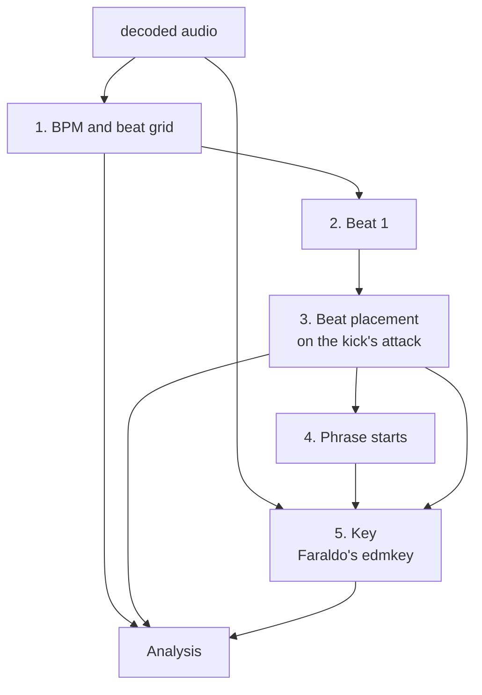
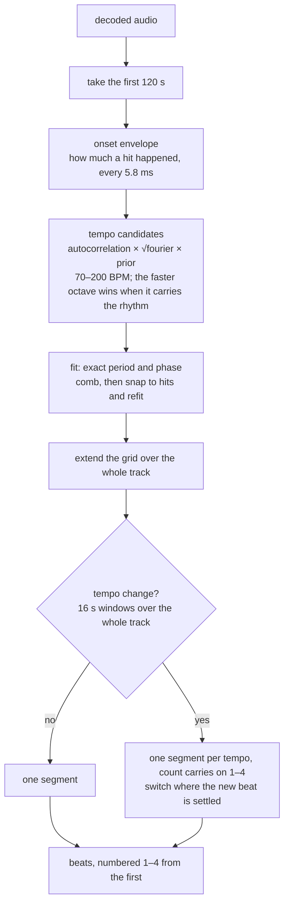
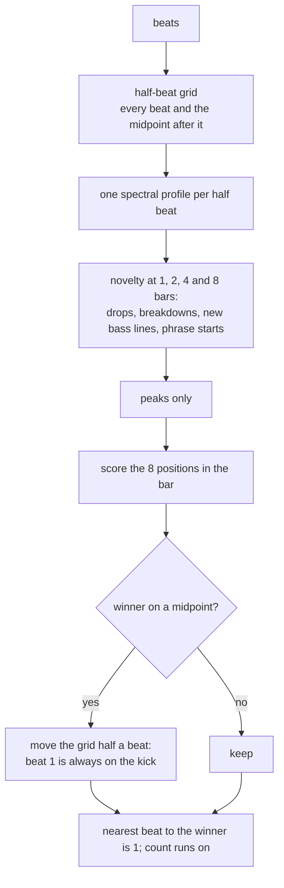
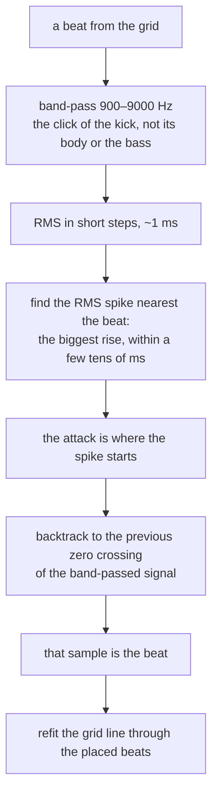
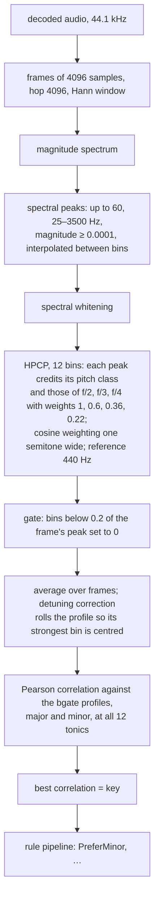

# Target pipeline

The analysis as Chris wants it to run, drawn before it is built. Every box
is marked: **built** (in the crate today, unchanged), **changes** (exists,
but not like this), or **new**. Numbers in brackets are the current gate
results ([golden-gate.md](golden-gate.md)). The track is assumed to be in
4/4 throughout.



## 1. BPM and beat grid



| box | status | note |
|---|---|---|
| first 120 s | **changes** | the BPM is read from the first 120 s only. Today the whole track is used. 120 s at 130 BPM is 260 beats, which the fit averages to well under 0.01 BPM, so precision holds |
| onset envelope, candidates, fit | built [155/155 BPM] | |
| extend over the whole track | **changes** | the grid is a straight line from the 120 s fit; today the line is fitted through the whole track |
| tempo change | built | this has to look at the whole track: a DJ edit changes tempo wherever it likes |

One thing to decide: a track whose tempo drifts (a live-played or
tape-sourced master) gets a worse grid from a 120 s fit than from a
whole-track fit. Nothing in the playlist drifts, so the gate cannot tell
the two apart.

## 2. Beat 1



All **built** [151/155]. This is the rule "the downbeat is where the music
changes" as it stands; beat 1 on the kick is what the half-beat move
enforces.

## 3. Beat placement on the kick's attack



| box | status | note |
|---|---|---|
| band-pass, RMS, spike, zero crossing | **new** | today a beat is the peak of the full-band onset envelope, sharpened by a parabola — on the attack to within ±3 ms of rekordbox on 140 of 144 MP3s |
| refit through placed beats | **changes** | the snap-and-refit exists; it would snap to these sample-accurate points instead of envelope peaks |

What this buys: a beat defined by the audio rather than by a 5.8 ms hop,
and a definition that can be checked by eye on a waveform. What to watch:
a zero crossing can sit a few ms before the spike on a slow attack, and
rekordbox's grids sit on the spike itself; the gate will show which of the
two rekordbox means.

## 4. Phrase starts

**Built.** The four-bar novelty peaks on downbeats, about six per track.
See [phrase.md](phrase.md). Phrase *labels* (intro, chorus…) stay
unimplemented.

## 5. Key — Faraldo's edmkey

Ángel Faraldo's method, as Essentia's `KeyExtractor` runs it. Every value
below is Essentia's default, taken from its source.



The `bgate` profiles (tonic first; note the zeros — "gated"):

```
major: 1.00 0.00 0.42 0.00 0.53 0.37 0.00 0.77 0.00 0.38 0.21 0.30
minor: 1.00 0.00 0.36 0.39 0.00 0.38 0.00 0.74 0.27 0.00 0.42 0.23
```

and `edma`, the profiles we use today (Essentia's rounding):

```
major: 1.00 0.29 0.50 0.40 0.60 0.56 0.32 0.80 0.31 0.45 0.42 0.39
minor: 1.00 0.31 0.44 0.58 0.33 0.49 0.29 0.78 0.43 0.29 0.53 0.32
```

`braw` (the same shape as `bgate` before gating) and `edmm` (a flat major
profile with an `edma`-like minor, i.e. "assume minor") are also in
Essentia.

| box | status | note |
|---|---|---|
| frames, spectrum | **changes** | we use 8192/4096; Faraldo uses 4096/4096 |
| spectral peaks, whitening | **new** | we credit every bin; Faraldo credits peaks only, whitened, which drops the noise floor between notes |
| HPCP with harmonics | built | our chroma folds f/2, f/3, f/4 down with the same weights; range 55–2000 Hz against his 25–3500 |
| gate at 0.2 | **new** | |
| average + detuning correction | **changes** | we average; our tuning offset exists but is off (measured no gain) |
| profiles | **changes** | we ship `edma`; `bgate` scored lower on our chroma, but has not been tried on his front end |
| rule pipeline | built | `PreferMinor` [89 → 130 of 155] |

The plan is to build his front end as a second `KeyOptions` preset and
let the rig (`golden key`) score it with each of the four profiles, with
and without `PreferMinor`, against today's 130.

## What is not in this picture

- The eleven rekordbox 6 grids, the two hand-made DJ-edit grids, and
  BATTERY OPERATED — see [golden-gate.md](golden-gate.md). None of the
  boxes above changes those.
- Phrase labels and vocal detection.
