# The pipeline

The analysis as a procedure: what happens first, what happens next, and
where it branches. The track is assumed to be in 4/4. The step numbers are
the ones the stage documents use.

```mermaid
flowchart TD
    S([start: decoded track]) --> S2

    subgraph P1 [Phase 1 — BPM]
        S2[1. Detect the BPM over the whole track<br/>candidates between 70 and 200; the faster octave wins<br/>when it carries the rhythm]
    end

    S2 --> S3

    subgraph P2 [Phase 2 — the grid on the kicks]
        S3[2. Lay a first grid at that BPM,<br/>phase from the hits] --> S4[3. For each beat, find the kick's attack:<br/>band-pass 900–9000 Hz, RMS in 1 ms steps,<br/>the start of the strong rise nearest the beat]
        S4 --> S6[4. Fit the grid line through the attacks<br/>and extend it over the whole track]
    end

    S6 --> Q1{5. Does the tempo change<br/>anywhere in the track?<br/>16 s windows, whole track}
    Q1 -- yes --> S7[6. Grid the change from the last settled bar at the old tempo:<br/>bar by bar where the kick can be followed,<br/>one cut where the kick states the new tempo where it cannot;<br/>then steps 1–5 on the settled stretch after it]
    S7 --> Q1
    Q1 -- no --> Q1c{7. Does a line lose its hits for two bars<br/>and find them again on another phase?}
    Q1c -- yes --> S7e[Cut where the hits come back;<br/>walk a ramp through the gap if the hits drift]
    S7e --> S8
    Q1c -- no --> S8

    subgraph P3 [Phase 3 — beat 1]
        S8[8. Find where the music changes:<br/>drops, breakdowns, new bass lines,<br/>phrase starts 8 or 16 bars apart] --> Q2{9. Do the changes land<br/>on the grid's beats, or<br/>between them?}
        Q2 -- between --> S9[10. The grid is on the off-beat:<br/>move it half a beat onto the kick]
        Q2 -- on --> S10
        S9 --> S10[11. The change-point that wins is beat 1;<br/>number every beat 1–4 from it,<br/>the count carrying on across a tempo cut]
        S10 --> S11[12. Mark the phrase starts:<br/>the strongest changes on downbeats]
    end

    S11 --> S12

    subgraph P4 [Phase 4 — key]
        S12[13. Run Faraldo's edmkey:<br/>4096-sample frames, spectral peaks 25–3500 Hz,<br/>whitening, HPCP with 4 harmonics, 0.2 gate,<br/>detuning correction] --> S13[14. Score all 24 keys against the edma profiles]
        S13 --> Q3{15. Major and its parallel<br/>minor a toss-up?}
        Q3 -- yes --> S14[16. Take the minor]
        Q3 -- no --> S16
        S14 --> S16[17. Name the key as rekordbox does]
    end

    S16 --> E([done: BPM, grid, beat 1, phrases, key])
```

## Step by step

| step | where | how |
|---|---|---|
| 1. detect the BPM | `onset.rs`, `tempo.rs` | onset envelope → autocorrelation × √fourier × prior, over the whole track ([beat.md](beat.md) §1) |
| 2. first grid, phase from the hits | `tempo.rs` | a comb over the onset envelope (§2) |
| 3. the kick's attack | `attack.rs` | the strong rise in the 900–9000 Hz RMS nearest the predicted beat, within 15 ms; the line is fitted from both halves of the beat and the half that collects more kick is kept (§3) |
| 4. fit through the attacks, extend over the track | `tempo.rs` | a weighted straight line, refitted without the outliers (§4) |
| 5. tempo change anywhere | `tempo.rs` | 16 s windows over the whole track (§5) |
| 6. grid the change | `tempo.rs` | a walk beat by beat from the old tempo's last settled window where the kick can be followed, cut every four beats; otherwise one cut where the kick states the new tempo at full level with the rest of the mix (§6). Steady tempos are whole numbers (§7); the count carries on across every change |
| 7. gaps | `tempo.rs`, `split_gaps` | a line that loses its hits for two bars: hold across the gap if the hits come back on the same grid, cut where they come back on another phase, walk a ramp through the gap where the hits drift towards a cut (§8) |
| 8–11. beat 1, the half-beat move, numbering | `downbeat.rs` | novelty peaks over half-beat spectral profiles at 1, 2, 4 and 8 bars ([downbeat.md](downbeat.md)) |
| 12. phrase starts | `downbeat.rs` | the four-bar novelty peaks that fall on downbeats ([phrase.md](phrase.md)) |
| 13–14. Faraldo's edmkey | `key.rs` | as Essentia's `KeyExtractor` runs it, with the `edma` profiles ([key.md](key.md)) |
| 15–16. minor on a toss-up | `key.rs` | the `PreferMinor` rule at a bias of 0.1 |
| 17. name | `key.rs` | rekordbox's `ScaleName` spellings |

Two more rules exist in `key.rs` and are not in the shipped pipeline:
`BassRoot` and `BassVote`, which read the bass line's root when the profile
match is not decisive. The gate measures them ([golden-gate.md](golden-gate.md),
`golden key`); on the reference playlist they fix nothing, so
`DEFAULT_RULES` is `PreferMinor` alone.
