# The pipeline

The analysis as a procedure: what happens first, what happens next, and
where it branches. The track is assumed to be in 4/4. The step numbers are
the ones the stage documents use.

This is the full BPM/grid pipeline. The app's
[Analysis Setting dialog](../../../docs/analysis-settings.md) selects what
to update before queueing tracks: key-only requests run key detection
without rewriting grid files. High precision selects attack placement;
the chosen BPM range bounds the search. Automatic imports use full analysis.

```mermaid
flowchart TD
    S([start: decoded track]) --> S2

    subgraph P1 [Phase 1 — BPM]
        S2[1. Detect the BPM over the whole track<br/>candidates between 70 and 200; the faster octave wins<br/>when it carries the rhythm]
    end

    S2 --> S3

    subgraph P2 [Phase 2 — the grid on the kicks]
        S3[2. Lay a first grid at that BPM,<br/>phase from the hits] --> S4[3. For each beat, find the kick's attack:<br/>band-pass 900–9000 Hz, RMS in 1 ms steps,<br/>the start of the strong rise nearest the beat]
        S4 --> S6[4. Fit the grid line through the attacks<br/>and extend it over the whole track]
    end

    S6 --> Q1{5. Does the tempo change<br/>anywhere in the track?<br/>16 s windows, whole track}
    Q1 -- yes --> S7[6. Grid the change from the last settled window:<br/>follow kicks or emphasised transients beat by beat;<br/>otherwise cut where the new beat is supported;<br/>continue with the settled fit]
    S7 --> Q1
    Q1 -- no --> Q1c{7. Does a line lose its hits for two bars<br/>and find them again on another phase?}
    Q1c -- yes --> S7e[Cut where the hits come back;<br/>walk a ramp through the gap if the hits drift]
    S7e --> S8
    Q1c -- no --> S8

    subgraph P3 [Phase 3 — beat 1]
        S8[8. Find where the music changes:<br/>drops, breakdowns, new bass lines,<br/>phrase starts 8 or 16 bars apart] --> Q2{9. Do the changes land<br/>on the grid's beats, or<br/>between them?}
        Q2 -- between --> S9[10. The grid is on the off-beat:<br/>move it half a beat onto the kick]
        Q2 -- on --> S10
        S9 --> S10[11. The change-point that wins is beat 1;<br/>number every beat 1–4 from it,<br/>the count carrying on across a tempo cut]
        S10 --> S11[12. Mark the phrase starts:<br/>the strongest changes on downbeats]
    end

    S11 --> Q0{12a. Boundary beat or opening cut under 20 ms,<br/>audio at the start,<br/>and compatible downbeat?}
    Q0 -- yes --> QC{Opening beat cut short?}
    QC -- yes --> ZC[Add beat 1.1 at zero;<br/>keep every later beat in place]
    QC -- no --> Z0[Anchor first segment at zero;<br/>regenerate beats starting with 1.1]
    ZC --> S12
    Q0 -- no --> S12
    Z0 --> S12

    subgraph P4 [Phase 4 — key]
        S12[13. Run Faraldo's edmkey:<br/>4096-sample frames, spectral peaks 25–3500 Hz,<br/>whitening, HPCP with 4 harmonics, 0.2 gate,<br/>detuning correction] --> S13[14. Score all 24 keys against the edma profiles]
        S13 --> Q3{15. Major and its parallel<br/>minor a toss-up?}
        Q3 -- yes --> S14[16. Take the minor]
        Q3 -- no --> S16
        S14 --> S16[17. Name the key as rekordbox does]
    end

    S16 --> E([done: BPM, grid, beat 1, phrases, key])
```

## Step by step

| step | where | how |
|---|---|---|
| 1. detect the BPM | `onset.rs`, `tempo.rs` | onset envelope → autocorrelation × √fourier × prior, over the whole track ([beat.md](beat.md) §1) |
| 2. first grid, phase from the hits | `tempo.rs` | a comb over the onset envelope (§2) |
| 3. the kick's attack | `attack.rs` | the strong rise in the 900–9000 Hz RMS nearest the predicted beat, within 15 ms; the line is fitted from both halves of the beat and the half that collects more kick is kept (§3) |
| 4. fit through the attacks, extend over the track | `tempo.rs` | a weighted straight line, refitted without the outliers (§4) |
| 5. tempo change anywhere | `tempo.rs` | 16 s windows over the whole track (§5) |
| 6. grid the change | `tempo.rs` | walk from the old tempo's last settled window, retaining every measured interval; prefer kicks and clicks, otherwise emphasise full-band transient rises by 4× with a 20 ms release. If the walk cannot settle, prefer a reliable new-kick run with the mix; otherwise cut using transient support (§6). Steady tempos are whole numbers (§7); the count carries on across every change |
| 7. gaps | `tempo.rs`, `split_gaps` | a line that loses its hits for two bars: hold across the gap if the hits come back on the same grid, cut where they come back on another phase, walk a ramp through the gap where the hits drift towards a cut (§8) |
| 8–11. beat 1, the half-beat move, numbering | `downbeat.rs` | novelty peaks over half-beat spectral profiles at 1, 2, 4 and 8 bars ([downbeat.md](downbeat.md)) |
| 12. phrase starts | `downbeat.rs` | the four-bar novelty peaks that fall on downbeats ([phrase.md](phrase.md)) |
| 12a. file-start adjustment | `lib.rs::anchor_file_start`, called by `analyse_with` | after half-beat correction and numbering, before key rules consume the grid; see below |
| 13–14. Faraldo's edmkey | `key.rs` | as Essentia's `KeyExtractor` runs it, with the `edma` profiles ([key.md](key.md)) |
| 15–16. minor on a toss-up | `key.rs` | the `PreferMinor` rule at a bias of 0.1 |
| 17. name | `key.rs` | rekordbox's `ScaleName` spellings |

Two more rules exist in `key.rs` and are not in the shipped pipeline:
`BassRoot` and `BassVote`, which read the bass line's root when the profile
match is not decisive. The gate measures them ([golden-gate.md](golden-gate.md),
`golden key`); on the reference playlist they fix nothing, so
`DEFAULT_RULES` is `PreferMinor` alone.

The transition fallback lives in `tempo.rs::TransitionTransients` and is
used by `walk_beats`, its diagnostic `walk_report`, and `boundary` when no
kick run qualifies. A kick-band peak below 0.15 permits the fallback; a
usable click still takes precedence during the walk. Only local maxima
at or above the 0.02 emphasised hit floor count. The release is an
exponential time constant, and timestamps come from the original envelope.
Whole-track tempo detection, settled fits, and the separate gap walker
continue to use their original inputs.

## File-start adjustment

The decision lives in [`anchor_file_start` in `src/lib.rs`](../src/lib.rs),
called by `analyse_with` after downbeat selection, half-beat correction and
beat numbering. It runs before any key rule consumes the completed grid.
Both application presets use this shared final adjustment.

A fitted beat can land just before zero, leaving the first emitted beat
almost one period into the file. The onset envelope also starts at its
first frame centre rather than at sample zero. The gate checks:

- The first segment begins within 15 ms of the file start. Its grid either
  has a boundary beat within 15 ms of zero or an opening beat cut short by
  strictly less than 20 ms. A cut of 20 ms or more does not qualify.
- Downbeat selection either chose the first emitted beat (which may be
  the fallback after dropping the boundary beat), or places the inferred
  opening beat on its downbeat cycle, accounting for the cut. A distinct later musical downbeat prevents adjustment.
- The full-band peak in the first 15 ms is at least `1e-5`, and the peak
  in the first millisecond is at least 10% of that local peak. This allows
  a waveform to start at a zero crossing while rejecting silence and a
  later attack. It does not look for a particular tick sound or frequency.

For a cut opening beat, `opening_cut_secs` estimates the missing duration
from the next fitted beat. Where that beat has an isolated attack after
silence, it refines the onset to sample precision using full-band audio;
this avoids counting the RMS detector's roughly 1 ms early placement as
part of the cut. With continuous audio it uses the fitted estimate.

When the opening beat is cut by less than 20 ms, only that beat is placed
at `0:00.00`. Every subsequent beat keeps its existing timestamp and BPM.
The first interval is therefore shorter than a full beat. A one-beat
opening segment represents this boundary exception, followed by the
original fitted grid; the beat numbers run 1–4 from the new beat 1.1.
For example, trimming 10 ms from a 128 BPM track gives an opening interval
of approximately 458.75 ms, followed by normal 468.75 ms intervals.

For an uncut boundary beat, the existing adjustment anchors the first
segment's start and phase to zero and regenerates its beats. Both paths
set `first_beat_secs` to zero and preserve later tempo segments. If the
gate fails, the grid is retained. This is a boundary heuristic: immediate
audio plus an aligned grid and compatible downbeat selection is treated as
the opening downbeat, not independent proof of musical bar structure.
Previously detected phrase-start times are retained.

The regression in [`tests/analysis.rs`](../tests/analysis.rs),
`rbxport_two_minute_ticks_start_with_beat_one_at_exactly_zero`, reproduces
the 48 kHz PCM16, 128 BPM, two-minute WAV. It requires all 256 beats, exact
zero for the first beat, correct 1–4 numbering and the expected timestamps
through the end. Companion tests cover a low-frequency beat, an absent
opening beat, and delayed attacks; the existing musical-change test
protects a later downbeat even when audio starts at zero. The trimmed-opening regression
uses a two-minute percussion signal with a longer tail, including trims
of 1, 5, 6.25 (a zero crossing), 10, 15, 19 and 19.979 ms. It checks that
all later beat timestamps and BPM values are unchanged and that the
segments reproduce the explicit grid. Trims of 20, 21 and 30 ms must
retain the original grid.
