# Target pipeline

The analysis as a procedure: what happens first, what happens next, and
where it branches. The track is assumed to be in 4/4. Below the chart,
each step is marked **built** (in the crate today), **changes** (exists,
but not like this) or **new**.

```mermaid
flowchart TD
    S([start: decoded track]) --> S1

    subgraph P1 [Phase 1 — BPM]
        S1[1. Take the first 120 seconds] --> S2[2. Detect the BPM<br/>candidates between 70 and 200; the faster octave wins<br/>when it carries the rhythm]
    end

    S2 --> S3

    subgraph P2 [Phase 2 — the grid on the kicks]
        S3[3. Lay a first grid at that BPM,<br/>phase from the hits] --> S4[4. For each beat, find the kick's attack:<br/>band-pass 900–9000 Hz, RMS in 1 ms steps,<br/>take the start of the spike nearest the beat]
        S4 --> S5[5. Backtrack from the attack<br/>to the previous zero crossing]
        S5 --> S6[6. Fit the grid line through those points<br/>and extend it over the whole track]
    end

    S6 --> Q1{7. Does the tempo change<br/>anywhere in the track?<br/>16 s windows, whole track}
    Q1 -- yes --> S7[8. Cut at the beat where the new tempo<br/>is settled and the kicks are reliable;<br/>repeat steps 2–6 on the stretch after the cut]
    S7 --> Q1
    Q1 -- no --> S8

    subgraph P3 [Phase 3 — beat 1]
        S8[9. Find where the music changes:<br/>drops, breakdowns, new bass lines,<br/>phrase starts 8 or 16 bars apart] --> Q2{10. Do the changes land<br/>on the grid's beats, or<br/>between them?}
        Q2 -- between --> S9[11. The grid is on the off-beat:<br/>move it half a beat onto the kick]
        Q2 -- on --> S10
        S9 --> S10[12. The change-point that wins is beat 1;<br/>number every beat 1–4 from it,<br/>the count carrying on across a tempo cut]
        S10 --> S11[13. Mark the phrase starts:<br/>the strongest changes on downbeats]
    end

    S11 --> S12

    subgraph P4 [Phase 4 — key]
        S12[14. Run Faraldo's edmkey:<br/>4096-sample frames, spectral peaks 25–3500 Hz,<br/>whitening, HPCP with 4 harmonics, 0.2 gate,<br/>detuning correction, bgate profiles] --> S13[15. Score all 24 keys]
        S13 --> Q3{16. Major and its parallel<br/>minor a toss-up?}
        Q3 -- yes --> S14[17. Take the minor]
        Q3 -- no --> Q4
        S14 --> Q4{18. Still not clear?}
        Q4 -- yes --> S15[19. Read the bass on the second eighth of each beat<br/>in the intro, the outro and the first two bars<br/>of each phrase; its root is the tonic]
        Q4 -- no --> S16
        S15 --> S16[20. Name the key as rekordbox does]
    end

    S16 --> E([done: BPM, grid, beat 1, phrases, key])
```

## Step by step

| step | status | note |
|---|---|---|
| 1. first 120 s | **changes** | the BPM is read from the first 120 s only; today the whole track is used. 260 beats at 130 BPM still average to well under 0.01 BPM |
| 2. detect the BPM | built | onset envelope → autocorrelation × √fourier × prior |
| 3. first grid, phase from the hits | built | comb over the onset envelope |
| 4. kick attack, 900–9000 Hz RMS spike | **new** | today the beat is the peak of the full-band onset envelope, sharpened by a parabola |
| 5. backtrack to the zero crossing | **new** | rekordbox's grids sit on the spike itself; the gate will say whether the zero crossing or the spike start matches it |
| 6. fit through the placed points, extend over the track | **changes** | the snap-and-refit exists; it would take these sample-accurate points |
| 7–8. tempo change, cut where the new beat is settled | built | the switch goes where the incoming beat is at full strength |
| 9–12. beat 1 from where the music changes; half-beat move; numbering | built | novelty peaks over half-beat profiles at 1, 2, 4 and 8 bars |
| 13. phrase starts | built | the four-bar novelty peaks on downbeats |
| 14–15. Faraldo's edmkey | **changes** | today: every bin (not peaks), 8192 frames, 55–2000 Hz, no whitening, no gate, edma profiles; the harmonic folding is the same |
| 16–17. minor on a toss-up | built | `PreferMinor` |
| 18–19. bass root when unsure | built, off | measured: fixes none on this playlist; stays in the pipeline |
| 20. name | built | |

## Open questions

1. Step 1: a master whose tempo drifts gets a worse grid from a 120 s fit
   than from a whole-track fit. Nothing in the playlist drifts, so the gate
   cannot tell the two apart.
2. Step 5: rekordbox's beat is at the start of the spike; the zero crossing
   before it can be a few ms earlier on a slow attack. Build both, let the
   gate choose.
