# Target pipeline

The analysis as a procedure: what happens first, what happens next, and
where it branches. The track is assumed to be in 4/4. Below the chart,
each step is marked **built** (in the crate today), **changes** (exists,
but not like this) or **new**.

```mermaid
flowchart TD
    S([start: decoded track]) --> S2

    subgraph P1 [Phase 1 — BPM]
        S2[1. Detect the BPM over the whole track<br/>candidates between 70 and 200; the faster octave wins<br/>when it carries the rhythm]
    end

    S2 --> S3

    subgraph P2 [Phase 2 — the grid on the kicks]
        S3[2. Lay a first grid at that BPM,<br/>phase from the hits] --> S4[3. For each beat, find the kick's attack:<br/>band-pass 900–9000 Hz, RMS in 1 ms steps,<br/>take the start of the spike nearest the beat]
        S4 --> S5[4. Backtrack from the attack<br/>to the previous zero crossing]
        S5 --> S6[5. Fit the grid line through those points<br/>and extend it over the whole track]
    end

    S6 --> Q1{6. Does the tempo change<br/>anywhere in the track?<br/>16 s windows, whole track}
    Q1 -- yes --> S7[7. Find the two settled tempos either side<br/>and the last bar at the old one]
    S7 --> S7b[7a. Bisect the next bar's downbeat:<br/>it lies between where the old tempo and the new tempo<br/>would put it; find the kick between those two bounds]
    S7b --> S7c[7b. Cut at that downbeat;<br/>the bar's tempo is its own length]
    S7c --> Q1b{7c. Is this bar already<br/>at the new settled tempo?}
    Q1b -- no --> S7b
    Q1b -- yes --> S7d[7d. Repeat steps 1–5 on the settled stretch after it]
    S7d --> Q1
    Q1 -- no --> S8

    subgraph P3 [Phase 3 — beat 1]
        S8[8. Find where the music changes:<br/>drops, breakdowns, new bass lines,<br/>phrase starts 8 or 16 bars apart] --> Q2{9. Do the changes land<br/>on the grid's beats, or<br/>between them?}
        Q2 -- between --> S9[10. The grid is on the off-beat:<br/>move it half a beat onto the kick]
        Q2 -- on --> S10
        S9 --> S10[11. The change-point that wins is beat 1;<br/>number every beat 1–4 from it,<br/>the count carrying on across a tempo cut]
        S10 --> S11[12. Mark the phrase starts:<br/>the strongest changes on downbeats]
    end

    S11 --> S12

    subgraph P4 [Phase 4 — key]
        S12[13. Run Faraldo's edmkey:<br/>4096-sample frames, spectral peaks 25–3500 Hz,<br/>whitening, HPCP with 4 harmonics, 0.2 gate,<br/>detuning correction, bgate profiles] --> S13[14. Score all 24 keys]
        S13 --> Q3{15. Major and its parallel<br/>minor a toss-up?}
        Q3 -- yes --> S14[16. Take the minor]
        Q3 -- no --> Q4
        S14 --> Q4{17. Still not clear?}
        Q4 -- yes --> S15[18. Read the bass on the second eighth of each beat<br/>in the intro, the outro and the first two bars<br/>of each phrase; its root is the tonic]
        Q4 -- no --> S16
        S15 --> S16[19. Name the key as rekordbox does]
    end

    S16 --> E([done: BPM, grid, beat 1, phrases, key])
```

## Step by step

| step | status | note |
|---|---|---|
| 1. detect the BPM | built | onset envelope → autocorrelation × √fourier × prior, over the whole track, so a tempo change anywhere is seen |
| 2. first grid, phase from the hits | built | comb over the onset envelope |
| 3. kick attack, 900–9000 Hz RMS spike | **new** | today the beat is the peak of the full-band onset envelope, sharpened by a parabola |
| 4. backtrack to the zero crossing | **new** | rekordbox's grids sit on the spike itself; the gate will say whether the zero crossing or the spike start matches it |
| 5. fit through the placed points, extend over the track | **changes** | the snap-and-refit exists; it would take these sample-accurate points |
| 6. tempo change anywhere | built | 16 s windows over the whole track |
| 7–7d. gradual change gridded bar by bar | **new** | today the old tempo is held to a single cut where the incoming beat is at full strength. With bisection, a rise or fall between two settled tempos — linear or not, up or down — gets a cut at every bar's first downbeat and each bar its own tempo, as rekordbox's per-beat tempo allows |
| 8–11. beat 1 from where the music changes; half-beat move; numbering | built | novelty peaks over half-beat profiles at 1, 2, 4 and 8 bars |
| 12. phrase starts | built | the four-bar novelty peaks on downbeats |
| 13–14. Faraldo's edmkey | **changes** | today: every bin (not peaks), 8192 frames, 55–2000 Hz, no whitening, no gate, edma profiles; the harmonic folding is the same |
| 15–16. minor on a toss-up | built | `PreferMinor` |
| 17–18. bass root when unsure | built, off | measured: fixes none on this playlist; stays in the pipeline |
| 19. name | built | |

## Open question

Step 4: rekordbox's beat is at the start of the spike; the zero crossing
before it can be a few ms earlier on a slow attack. Build both, let the
gate choose.
