# Target pipeline

The analysis as a procedure: what happens first, what happens next, and
where it branches. The track is assumed to be in 4/4. Below the chart,
each step is marked **built** (in the crate today), **changes** (exists,
but not like this) or **new**.

```mermaid
flowchart TD
    S([start: decoded track]) --> S2

    subgraph P1 [Phase 1 — BPM]
        S2[1. Detect the BPM over the whole track<br/>candidates between 70 and 200; the faster octave wins<br/>when it carries the rhythm]
    end

    S2 --> S3

    subgraph P2 [Phase 2 — the grid on the kicks]
        S3[2. Lay a first grid at that BPM,<br/>phase from the hits] --> S4[3. For each beat, find the kick's attack:<br/>band-pass 900–9000 Hz, RMS in 1 ms steps,<br/>take the start of the spike nearest the beat]
        S4 --> S6[4. Fit the grid line through the attacks<br/>and extend it over the whole track]
    end

    S6 --> Q1{5. Does the tempo change<br/>anywhere in the track?<br/>16 s windows, whole track}
    Q1 -- yes --> S7[6. Find the two settled tempos either side<br/>and the last bar at the old one]
    S7 --> S7b[7a. Bisect the next bar's downbeat:<br/>it lies between where the old tempo and the new tempo<br/>would put it; find the kick between those two bounds]
    S7b --> S7c[7b. Cut at that downbeat;<br/>the bar's tempo is its own length]
    S7c --> Q1b{7c. Is this bar already<br/>at the new settled tempo?}
    Q1b -- no --> S7b
    Q1b -- yes --> S7d[7d. Repeat steps 1–5 on the settled stretch after it]
    S7d --> Q1
    Q1 -- no --> S8

    subgraph P3 [Phase 3 — beat 1]
        S8[7. Find where the music changes:<br/>drops, breakdowns, new bass lines,<br/>phrase starts 8 or 16 bars apart] --> Q2{8. Do the changes land<br/>on the grid's beats, or<br/>between them?}
        Q2 -- between --> S9[9. The grid is on the off-beat:<br/>move it half a beat onto the kick]
        Q2 -- on --> S10
        S9 --> S10[10. The change-point that wins is beat 1;<br/>number every beat 1–4 from it,<br/>the count carrying on across a tempo cut]
        S10 --> S11[11. Mark the phrase starts:<br/>the strongest changes on downbeats]
    end

    S11 --> S12

    subgraph P4 [Phase 4 — key]
        S12[12. Run Faraldo's edmkey:<br/>4096-sample frames, spectral peaks 25–3500 Hz,<br/>whitening, HPCP with 4 harmonics, 0.2 gate,<br/>detuning correction, bgate profiles] --> S13[13. Score all 24 keys]
        S13 --> Q3{14. Major and its parallel<br/>minor a toss-up?}
        Q3 -- yes --> S14[15. Take the minor]
        Q3 -- no --> Q4
        S14 --> Q4{16. Still not clear?}
        Q4 -- yes --> S15[17. Read the bass on the second eighth of each beat<br/>in the intro, the outro and the first two bars<br/>of each phrase; its root is the tonic]
        Q4 -- no --> S16
        S15 --> S16[18. Name the key as rekordbox does]
    end

    S16 --> E([done: BPM, grid, beat 1, phrases, key])
```

## Step by step

| step | status | note |
|---|---|---|
| 1. detect the BPM | built | onset envelope → autocorrelation × √fourier × prior, over the whole track |
| 2. first grid, phase from the hits | built | comb over the onset envelope |
| 3. kick attack, 900–9000 Hz RMS spike | built | `attack.rs`: the strong rise nearest the predicted beat, within 15 ms. The line is fitted from both halves of the beat and the one that collects more kick is kept; the novelty stage still has the last word on the half beat. Beats land at 0.0 ms from rekordbox's at the median and the 90th percentile, against +1.0 / +3.0 from the envelope peak |
| 4. fit through the attacks, extend over the track | built | |
| 5. tempo change anywhere | built | 16 s windows over the whole track |
| 6–6d. gradual change gridded bar by bar | built | the walk tracks beat by beat from the old tempo's last settled window, the period drifting up to 5 % per beat, and cuts every four beats until a bar comes out at the new tempo; a jump, or no kick to follow, is a cut placed where the kick states the new tempo at full level and with the rest of the mix ([beat.md](beat.md), step 6): seven of the ten hand-gridded changes on the multi-tempo playlist within 3 ms. Proven on a synthetic ramp (128 → 155 over 64 beats); on the playlist's one ramp (Go Back) the rise starts in a breakdown with no kick to follow, so the cut goes where the hand grid has it. Steady tempos are whole numbers of BPM; the count carries on across every change |
| gaps: a line that loses its hits for two bars; a cut where the music comes back on another phase; a ramp walked through the gap | built | `split_gaps` after the segments are fitted. Each half of the gap on its own kicks by the kick band's envelope; a cut only when both halves are decisive, differ by a tenth of a beat, and the new line carries 1.5× the kick; a ramp only where it leads to a cut. BATTERY OPERATED: 130 to bar 65, 25 walked beats down to 22 BPM, the cut at 147.029 s where the hand grid has it |
| 7–10. beat 1 from where the music changes; half-beat move; numbering | built | novelty peaks over half-beat profiles at 1, 2, 4 and 8 bars |
| 11. phrase starts | built | the four-bar novelty peaks on downbeats |
| 12–13. Faraldo's edmkey | built | as Essentia runs it; `edma` profiles. 141 of 155 against 132 for the old chroma front end |
| 14–15. minor on a toss-up | built | `PreferMinor` at 0.1: fires on 61, fixes 54, breaks 6 |
| 16–17. bass root when unsure | built, off | measured: fixes none on this playlist; stays in the pipeline |
| 18. name | built | |

## Open questions

None.
