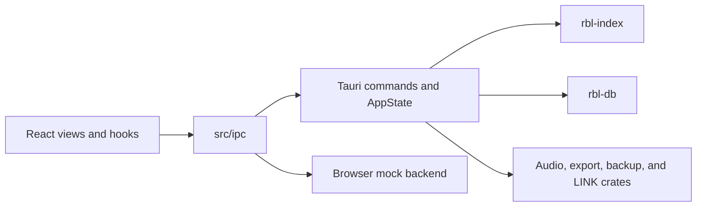
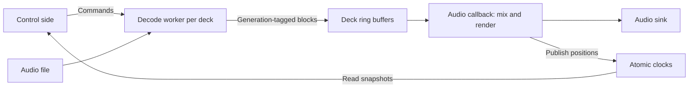

# Architecture

[Documentation](../README.md) · Next: [Development conventions](conventions.md)

The React interface calls a typed IPC boundary. Tauri coordinates application
state and native services. The `rbl-*` crates own database, indexing, audio,
export, and protocol logic without depending on Tauri.



## Repository layout

| Path | What is there |
| --- | --- |
| `src/` | The React interface. `views/` holds the screens, `store/` the hooks that hold state, `ipc/` the only code allowed to call the backend, `i18n/` the strings. |
| `src-tauri/` | The app shell: Tauri commands, app state, windows, menus, updater, logging. `src-tauri/src/lib.rs` registers commands; many handlers live in `src-tauri/src/commands.rs`. |
| `crates/` | The Rust libraries that do the work, all prefixed `rbl-`. They know nothing about Tauri. |
| `e2e/` | Playwright tests, run in Chromium and WebKit against the mock backend. |
| `docs/` | Developer guides, user guides, and technical references. |
| `scripts/` | Development utilities for cleanup, deployment, versioning, generated files, bundle checks, and release notes. |
| `public/locales/` | Generated translations. |

### The crates

Use the [crate guide](../../crates/README.md) to find each crate's onboarding
README, code map, safety contracts, and focused checks.

| Crate | Job |
| --- | --- |
| `rbl-core` | Ids, time formats and durable file publishing shared by everything. |
| `rbl-db` | Opens rekordbox's SQLCipher `master.db`. `write.rs` holds every write the app makes; `fixture.rs` builds a throwaway library with the real schema for tests. |
| `rbl-index` | Loads the whole library into memory as columns. Sorting, filtering and searching happen here, not in the interface. |
| `rbl-anlz` | Reads and writes rekordbox's ANLZ analysis files (`.DAT`, `.EXT`, `.2EX`): grids, cues, waveforms. |
| `rbl-audio` | Decodes audio for analysis. |
| `rbl-analysis` | Tempo, beat grid, key and waveform analysis. |
| `rbl-deck` | Playback: two decks, the audio device, beat and key sync, scrubbing. |
| `rbl-export` | Writes a USB export: `export.pdb` through `rbl-pdb` and `exportLibrary.db` through `rbl-onelibrary`. |
| `rbl-pdb` | The DeviceSQL `export.pdb` format. |
| `rbl-onelibrary` | The SQLCipher `exportLibrary.db` (Device Library Plus / OneLibrary). |
| `rbl-devices` | Finds removable drives and reads what is already exported to them. |
| `rbl-backup` | Backup archives and restoring them. |
| `rbl-link` | LINK: the beacon, database server and file server a CDJ talks to, serving the library the way rekordbox does. |
| `rbl-prolink` | Pro DJ Link packets and the device table. |
| `rbl-dbserver` | The remote-database protocol a CDJ browses with (TCP 12523). |
| `rbl-nfs` | The read-only NFSv2 server a CDJ loads audio from. |
| `rbl-fakecdj` | A stand-in CDJ for testing the link servers over loopback. |
| `rbl-difftool` | Records what rekordbox itself changes in `master.db`, so writes copy rekordbox rather than guess. |

## How a request flows

1. A view calls a function on the backend object from `getBackend()` in
   `src/ipc/client.ts`. Inside Tauri that is `invoke(...)`; in a browser it is
   the mock.
2. The Tauri command in `src-tauri/src/` does blocking work on a worker
   thread and reads the library from `AppState` (`state.rs`).
3. The interface never receives the whole library. It opens a view (a sort, a
   filter, a search) that `rbl-index` evaluates, then fetches windows of rows
   by index as the table scrolls.

Edits go through one path. A command calls `edit(...)` in `commands.rs`,
which runs a `rbl_db::write::Writer` method inside `AppState::write_then`, then
`refresh_after_edit` re-reads only what changed (`Touched::Playlists`,
`Touched::Metadata`, and so on). The backend then emits `library:changed`
with a new generation, and the interface drops the pages it has cached.
Tag List edits emit `tag-list:changed` and keep the generation. The same path
serves edits made from a CDJ over LINK (`src-tauri/src/link.rs`).

### Library edit sequence

This is the ordinary UI edit path in `commands.rs` and `state.rs`. The worker
serializes edits and checks restore/recovery state before opening a writer.
The success event is emitted only after the edit and targeted refresh return
success; this diagram does not imply that refresh and database writes are one
atomic transaction.

```mermaid
sequenceDiagram
    participant UI as React view / store
    participant IPC as src/ipc
    participant Cmd as Tauri command
    participant State as AppState worker
    participant DB as rbl-db Writer
    participant Index as rbl-index snapshot
    UI->>IPC: Request edit
    IPC->>Cmd: Typed backend call
    Cmd->>State: Run blocking edit
    State->>State: Serialize; check restore and recovery
    State->>DB: Open guarded writer and apply edit
    DB-->>State: Result
    alt Edit succeeds
        State->>Index: Refresh affected data
        Index-->>State: Generation
        State-->>Cmd: Success
        Cmd-->>UI: Change event and command result
        UI->>UI: Invalidate affected cached state
    else Edit fails
        State-->>Cmd: Contextual error
        Cmd-->>IPC: Error result
        IPC-->>UI: Display translated error
    end
```

### Audio execution boundaries

Playback separates control, file decoding, and real-time rendering. See
[`rbl-deck`](../../crates/rbl-deck/README.md) for the API and callback contracts.



The callback must not perform file I/O, allocate in steady state, or wait on
locks. Missing queued audio produces silence rather than blocking rendering.

The [analysis guide](../../crates/rbl-analysis/README.md) and
[playback guide](../../crates/rbl-deck/README.md) provide crate-specific
reading paths, API maps, and validation workflows.

## Where to start for a feature

| Feature | Main entry points |
| --- | --- |
| Collection browsing | `src/store/useTrackView.ts`, `src-tauri/src/commands.rs`, `crates/rbl-index/`. |
| Library metadata and playlists | `src-tauri/src/commands.rs`, `state.rs`, `crates/rbl-db/src/write.rs`. |
| Analysis queue | `src/store/useAnalysis.ts`, `src-tauri/src/analysis.rs`, `crates/rbl-analysis/`. |
| Playback and scrubbing | `src/store/usePlayback.ts`, `src-tauri/src/player.rs`, `crates/rbl-deck/`. |
| USB export and sync | `src-tauri/src/commands.rs`, `crates/rbl-export/`, `rbl-devices`, `rbl-pdb`, `rbl-onelibrary`, `rbl-anlz`. |
| LINK | `src-tauri/src/link.rs`, `crates/rbl-link/`, `rbl-prolink`, `rbl-dbserver`, `rbl-nfs`. |
| Backups | `src-tauri/src/backups.rs`, backup helper modules, `crates/rbl-backup/`. |
| Preferences and updates | `src-tauri/src/preferences.rs`, `update.rs`, corresponding frontend hooks. |
| macOS scripting | `src-tauri/src/scripting/`; see [AppleScript](../user/applescript.md). |

## Public and private boundaries

Public crates and tests must build without AlphaTheta Emulator, proprietary
firmware, or a private rekordbox library. The public Rust examples generate
fixtures for private harnesses but do not invoke the emulator themselves.
`rbl-fakecdj` is a protocol test client, not a firmware emulator.

The [private runner](../../scripts/tests-private.mjs) delegates to
`rbxport-private`. That repository owns the CDJ-3000 and XDJ-AZ harnesses,
local evidence, and physical USB-format acceptance tooling.
