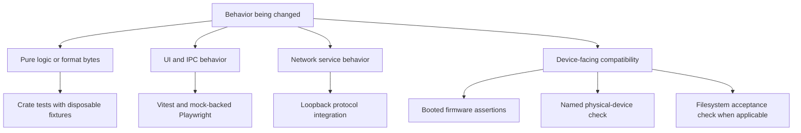

# Testing

[Documentation](../README.md) · Next: [Contributing](../../CONTRIBUTING.md)

Choose a test boundary that exercises the behavior you changed. A mock UI
pass, a socket test, an emulator run, and a physical-device result establish
different things. Report the command, source revision, and relevant boundary.

## Choose the validation boundary

Use the smallest check that can catch the defect, then add the relevant wider
boundary checks. These are complementary evidence layers, not a ladder where
one passing result automatically establishes the next.



A mock UI test cannot prove native database writes; a protocol client cannot
prove firmware navigation; emulator playback cannot prove physical audio or
FAT32 behavior on a real USB device. Record each result separately.

## Protect library data

Set `RB_LITE_TEST=1` for Rust checks; `RBXPORT_TEST=1` is the current equivalent.
These guards refuse writes to a detected installed library. Writable tests
must use `rbl_db::fixture::build` or another explicitly disposable fixture;
the environment variable does not redirect the app to test data.

Never use an installed rekordbox library as a writable development/test target.
Do not disable protection to make a test pass. Browser mocks do not open it.

## Public checks

| Layer | Location / command | What it checks |
| --- | --- | --- |
| Frontend lint | `pnpm lint` | React, TypeScript, and architectural restrictions. |
| Frontend build | `pnpm build` | TypeScript and the production bundle. |
| Frontend unit | `pnpm test` | Vitest behavior in the configured source/test paths. |
| Rust unit and integration | `RB_LITE_TEST=1 cargo test --workspace` | Crate behavior, generated audio, temporary databases, and protocol sessions. |
| Rust lint | `cargo clippy --workspace --all-targets -- -D warnings` | Workspace lint and warning policy. |
| Performance budget | `pnpm budget` | Budget schema and production bundle size. |
| Browser interaction | `pnpm e2e` | Chromium/WebKit UI with the mock backend and production-preview checks. |

Install Playwright browsers once with
`pnpm exec playwright install chromium webkit`. Build before running budget
or browser checks; Playwright also serves `dist/` through Python's HTTP server.
Use `E2E_PORT=1500 pnpm e2e` when another checkout uses the default port.

Start small, for example:

```sh
pnpm exec vitest run src/store/useAnalysis.test.tsx
pnpm exec playwright test e2e/analysis.spec.ts
RB_LITE_TEST=1 cargo test -p rbl-analysis
RB_LITE_TEST=1 cargo test -p rbl-dbserver --test session
RB_LITE_TEST=1 cargo test -p rbl-link --test link
```

`rbl-fakecdj` drives protocol servers over loopback. It exercises socket
framing and server behavior without booting vendor firmware.
Some script checks use Node's own test runner rather than the Vitest glob;
run the relevant file with `node --test scripts/<name>.test.mjs` when changing it.

## Private suites

Tests requiring AlphaTheta Emulator, imported firmware, private assets, or
physical hardware live in `rbxport-private`. Registered firmware suites run
from this public checkout:

```sh
npm run tests:private
npm run tests:private -- cdj-3000
npm run tests:private -- xdj-az
```

The default runs CDJ-3000 then XDJ-AZ, sequentially, and stops on failure.
The runner validates suite names and harness paths before starting either.
Set `RBXPORT_PRIVATE_REPO` when the private repository is not a sibling;
`ATEMU_DIR` selects the emulator checkout.

| Suite | Harness in rbxport-private | Behavior |
| --- | --- | --- |
| `cdj-3000` | `scripts/e2e-link/run.sh` | Build RBX, create a three-track fixture, boot a bridged CDJ-3000, and drive LINK browsing/loading/interactions through its firmware panel. |
| `xdj-az` | `scripts/e2e-xdj-az/run.sh` | Generate a disposable FAT32 export, browse its playlist, load deck 1, and run audio/cue assertions. |

The CDJ suite needs the built emulator, imported firmware, Python with pytest
and Pillow, and bridge-helper access (`sudo -n` on its documented host setup).
The AZ suite additionally uses macOS disk-image tools and an imported cabinet
image (`ATEMU_XDJ_AZ_CABINET` overrides its path). The harness calls audio tests
in AtEmu's `tests/test_xdj_az_playback.py`; the current gate uses 44100 Hz and
exclusive audio capture. Follow the private harness README for host setup.

Evidence is saved in the private repository's `verification/` directory.
Physical USB formatting has a separate destructive opt-in harness and is not
included in this default run. Private macOS/Windows app harnesses also retain
their own entry points. Do not infer a physical pass from emulator audio.

## Before review

For a substantial change, run all applicable checks:

```sh
cargo clippy --workspace --all-targets -- -D warnings
RB_LITE_TEST=1 cargo test --workspace
pnpm lint
pnpm build
pnpm test
pnpm budget
pnpm e2e
```

Run relevant private suites for firmware-facing changes when the tools are
available. Explain missing checks, failures, and remaining physical-device
coverage in the PR. Required generator output accompanies source changes;
see [Conventions](conventions.md).

## Feature-specific validation

- [LINK behavior catalog](../reference/link-testing.md): firmware/model coverage and physical result format.
- [Analysis evaluation](../../crates/rbl-analysis/docs/validation/reference-playlist.md): private reference playlists and recorded scores.
- [USB format verification](../reference/usb-export-db.md#11-verifying-the-result): structural comparisons and compatibility limits.
- [Performance conventions](conventions.md#performance): enforced budgets and measurements.
